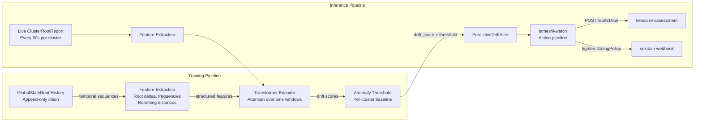
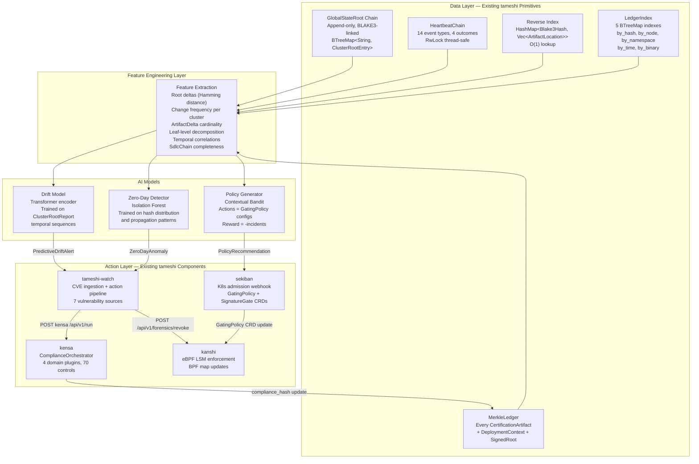

# AI Immune System: Predictive Threat Detection from Merkle-Structured Infrastructure State

## 1. The Thesis

The Global State Root produces a mathematically deterministic, append-only history of every infrastructure state transition across all clusters. This is not syslog data. This is cryptographically structured state -- every entry is a Merkle tree binding provenance, compliance, and intent into a single hash. This structure makes it the ideal training dataset for security AI because:

1. **Every data point has cryptographic provenance.** Each `CertificationArtifact` records exactly what produced it (`artifact_hash` from `NixCollector` or `OciCollector`), what compliance assessment validated it (`control_hash` from kensa), and what infrastructure intent declared it (`intent_hash` from `PangeaSynthesisCollector`). The `SignedRoot` binds the artifact to a specific `AkeylessDfcSigner` identity and timestamp. Tampering with any field changes the `composed_root`, breaking the chain.

2. **The state space is finite and enumerable.** There are exactly N `composed_root` values across M clusters, each a 256-bit BLAKE3 hash of known structure. The `GlobalStateRoot` is a deterministic function of sorted `ClusterRootEntry` values stored in a `BTreeMap<String, ClusterRootEntry>`. Two independent observers processing the same cluster reports produce identical roots.

3. **Transitions are atomic and observable.** When a `ClusterRoot` changes, the `ClusterRootReport` includes `added_artifacts` and `removed_artifacts` as explicit `ArtifactDelta` vectors. The delta is the complete diff -- no log parsing, no heuristics, no missing entries.

4. **Ground truth is built-in.** The `HeartbeatChain` records every ALLOW and DENY decision across 14 event types (`AdmissionDecision`, `GateVerification`, `ComplianceAssessment`, `Certification`, `GateCheck`, `BinaryVerification`, `ScriptVerification`, `BreakGlass`, `Revocation`, and five IaC test phases). Each entry is a labeled data point: event type + outcome + timestamp + verifier identity. This is supervised training data generated automatically as a byproduct of normal operation.

Compare this to syslogs:

- Unstructured text, no cryptographic binding
- No guarantee the log was not modified
- No mathematical relationship between log entries
- Requires NLP parsing, regex, and heuristics to extract meaning
- Cannot prove completeness (missing logs are undetectable)

The `HeartbeatChain` proves completeness: entries are BLAKE3-linked (`entry_hash = BLAKE3(sequence || timestamp || verifier || event || result || resource || signature_checked || previous_hash)`). A gap in the sequence number or a broken `previous_hash` linkage is detectable by `verify_integrity()` and by the `ConsistencyProof` API. Missing data is mathematically impossible without detection.

---

## 2. Why Merkle Data is Superior for Security AI

### Hamming Distance in Hash Space

Small changes in infrastructure produce large changes in the Merkle root. BLAKE3's avalanche property guarantees that flipping a single bit in any input changes approximately 50% of the output bits. For the AI, this means:

- A "normal" `GlobalStateRoot` should be temporally smooth -- consecutive roots in the chain differ by predictable amounts based on the number of `ArtifactDelta` entries.
- A sudden jump in Hamming distance between consecutive `GlobalStateRoot` entries signals a significant state change: a mass deployment, a mass revocation, or an anomaly.
- The Hamming distance between `ClusterRoot` values across clusters reveals correlation: clusters that change together (same deployment pipeline) versus clusters that change independently.

This is free signal. No feature engineering required -- the hash properties encode it.

### Hierarchical Decomposition

The 3-leaf `CertificationArtifact` allows the model to isolate which dimension changed:

```
                composed_root
                /            \
        internal_01          leaf_2 (intent_hash)
        /          \
leaf_0 (artifact)  leaf_1 (control)
```

- **Leaf 0 changed, leaves 1-2 unchanged:** The binary changed but compliance and intent are the same. Normal deployment of a new build.
- **Leaf 1 changed, leaves 0 and 2 unchanged:** Compliance status changed without a new binary or intent change. A re-assessment was triggered, possibly by a new CVE from tameshi-watch.
- **Leaf 2 changed, leaves 0-1 unchanged:** Infrastructure intent changed (Pangea synthesis produced new Terraform JSON) but no new binary was deployed. Configuration drift.
- **All three changed simultaneously:** A full deployment cycle completed. Expected pattern.
- **Leaf 0 changed, leaf 1 unchanged:** A new binary was deployed without a compliance re-assessment. Potential policy gap.

This hierarchical structure IS the feature space. The model does not need hand-crafted features -- the Merkle tree architecture provides them at construction time.

### Deterministic Replay

Every state transition is recorded with its full context: `MerkleLedgerEntry` contains the `CertificationArtifact`, `SignedRoot`, and `DeploymentContext` (cluster, namespace, node, pod, container, image_ref, binary_paths, optional `sdlc_chain_hash`, optional `compliance_report_hash`). The AI can:

1. Replay any historical window by reading `GlobalStateRoot` chain entries via `GET /api/v1/global/history?from=...&to=...`
2. Reconstruct the exact state of any cluster at any point in time via the `MerkleLedger` and `LedgerIndex` (5 BTreeMap indexes: by_hash, by_node, by_namespace, by_time, by_binary)
3. Compare its predictions against what actually happened (the labeled ALLOW/DENY decisions in the `HeartbeatChain`)

This enables offline training on historical data and online validation against live decisions.

### Label-Free Anomaly Detection

The AI does not need labeled "attack" data. It learns the distribution of normal state transitions:

- How often `GlobalStateRoot` changes (approximately every 60 seconds, per `FederationConfig.replication_interval_secs`)
- How many `ArtifactDelta` entries per `ClusterRootReport` (typical deployment size)
- Which clusters change together (pipeline correlation)
- What `ClusterStatus` transitions look like (Active to Stale to Offline follows a predictable pattern)
- What time of day deployments occur (deployment windows)

Anything outside this learned distribution is an outlier. The model flags deviations, not attacks. Whether the deviation is a misconfiguration, an unauthorized deployment, or an active intrusion is a downstream triage decision -- but the detection is automatic.

---

## 3. Three Core Capabilities

### 3.1 Predictive Drift Analysis

**Problem.** Configuration changes that precede breaches often look benign in isolation. A Helm value override here, a new dependency there. The breach happens days later when the accumulated drift creates an exploitable state. By the time kanshi blocks a compromised binary at `bprm_check_security`, the attacker has already achieved lateral movement through configuration weaknesses that each individually passed gating.

**Solution.** Train a sequence model (transformer encoder or LSTM) on the temporal sequence of `ClusterRootReport` submissions. Each report contains `cluster_root` (the aggregate hash), `added_artifacts` (new `ArtifactDelta` entries), `removed_artifacts` (revoked hashes), `node_count`, and `artifact_count`. The model learns:

- **Normal change frequency per cluster.** Production (`plo-us-east`) changes approximately 3 times per day during business hours. Edge fleets (`edge-fleet-07`) report every 300 seconds but the `ClusterRoot` changes only on firmware updates. A cluster that suddenly starts changing every minute outside its normal window is anomalous.
- **Normal change magnitude.** A typical deployment adds 5-20 `ArtifactDelta` entries. A change adding 500 artifacts in a single report is either a major rollout (correlated with an SdlcChain checkpoint) or a mass compromise.
- **Correlated changes.** When `plo-us-east` changes, `plo-eu-west` usually follows within one hour (same deployment pipeline, different regions). If `plo-us-east` changes and `plo-eu-west` does not follow within the expected window, either the pipeline stalled or the clusters diverged.
- **Pre-breach patterns.** From historical incident data (if available): what sequence of `ArtifactDelta` patterns preceded past `Revocation` events in the `HeartbeatChain`.

**Output.** A drift score per cluster per time window. When the drift score exceeds a configurable threshold, emit a `PredictiveDriftAlert` to tameshi-watch, which can:

- Trigger a compliance re-assessment (`POST kensa /api/v1/run`)
- Flag the cluster for manual review in the `GlobalBlastRadiusReport`
- Automatically tighten enforcement: update the `GatingPolicy` from `fail_open: true` to `fail_open: false`, or reduce `max_signature_age_secs`



### 3.2 Zero-Day Anomaly Detection

**Problem.** A zero-day exploit introduces a previously unseen binary hash. Traditional systems wait for CVE databases to be updated -- NVD, OSV, GitHub Advisory, Rust Advisory (all seven sources ingested by tameshi-watch). By then, the binary may have been executing for hours across dozens of clusters. kanshi's BPF `tameshi_allow_map` will contain the hash if it was legitimately attested, meaning the binary passed all gating points. The zero-day is invisible to the existing system because the compromised dependency was attested before the vulnerability was discovered.

**Solution.** Monitor the global reverse index (`HashMap<Blake3Hash, Vec<ArtifactLocation>>`) for "synchronized unknown hashes" -- new `composed_root` values appearing across multiple clusters within a short time window that do not match any known `ArtifactDelta` pattern.

The AI learns:

- **Normal new-hash introduction rate.** Deployments follow a schedule. New hashes appear in staging (`zek`) before production (`plo`), never the reverse. A hash that appears in production without a prior staging attestation violates the expected `SdlcChain` progression (SourceCommit -> CiBuild -> NixEvaluation -> ContainerBuild -> HelmPackage -> GitOpsSync -> K8sAdmission -> RuntimeExecution).
- **Normal hash propagation pattern.** A new application binary hash propagates from CI to staging to production over hours or days. A hash that appears on 5+ clusters within 10 minutes skipped the normal pipeline.
- **Normal hash correlation.** A new application binary (`artifact_hash`) correlates with a new Helm chart hash (RenderedHelmCollector) and a new Pangea synthesis hash (`intent_hash`). All three leaves of the `CertificationArtifact` change together. A change to `artifact_hash` alone, without corresponding `intent_hash` or `control_hash` changes, is suspicious.

**Zero-day signal.** A new `composed_root` appears on 5+ clusters within 10 minutes. It does not correlate with any `SdlcChain` checkpoint. Its `CertificationArtifact` has a zero `intent_hash` (no Pangea synthesis) or a zero `control_hash` (no compliance assessment). The `DeploymentContext` does not include an `sdlc_chain_hash`. This is either a zero-day supply chain attack or a severe misconfiguration -- both warrant immediate investigation.

**Output.** `ZeroDayAnomaly` alert containing:

| Field | Source | Value |
|-------|--------|-------|
| Unknown hash | `ArtifactDelta.composed_root` | The `composed_root` that triggered the alert |
| Affected clusters | Global reverse index query | All clusters and nodes where the hash appeared |
| Time window | `ClusterRootReport` timestamps | First and last appearance across all clusters |
| Confidence score | Model output | Based on deviation from learned propagation patterns |
| Missing attestation | `CertificationArtifact` leaf analysis | Which leaves are zero (no provenance, no compliance, no intent) |
| Recommended action | Risk classification | Quarantine (revoke via `POST /api/v1/forensics/revoke`), investigate, or auto-revoke |

### 3.3 Automated Policy Generation

**Problem.** Writing `GatingPolicy` rules by hand is error-prone. Security teams must decide: which of the 14 `LayerType` variants to require, what `max_signature_age_secs`, whether to set `require_certification_artifacts: true`, and whether `fail_open` is acceptable for a given cluster. A misconfigured policy (too permissive) creates blind spots. An overly strict policy (requiring all 14 layers for edge devices with intermittent connectivity) causes operational failures.

**Solution.** Analyze the historical relationship between policy configurations and security outcomes:

- When `require_certification_artifacts: false`, how often did unattested binaries execute? (Count `BinaryVerification` + `Allowed` events in the `HeartbeatChain` where the corresponding `CertificationArtifact` had a zero `control_hash`.)
- When `max_signature_age_secs: 3600`, how many stale signatures were the root cause of `Revocation` events? (Correlate `SignedRoot.signed_at` timestamps with subsequent `HeartbeatEvent::Revocation` entries.)
- Which `required_layers` configurations had the lowest incident rate? (Group clusters by their active `GatingPolicy` and compute incident density per configuration.)
- What is the false positive rate (legitimate deployments blocked) versus false negative rate (compromised binaries allowed) for each policy configuration?

The AI generates optimal policy configurations per cluster based on its risk profile:

```json
{
  "cluster": "plo-us-east",
  "recommended_policy": {
    "name": "plo-us-east-ai-optimized",
    "required_layers": ["Nix", "Oci", "Helm", "PangeaSynthesis"],
    "require_compliance": true,
    "require_certification_artifacts": true,
    "max_signature_age_secs": 1800,
    "fail_open": false
  },
  "confidence": 0.94,
  "rationale": {
    "based_on": "180 days of historical state transitions",
    "incident_count_with_config": 0,
    "false_positive_rate": 0.02,
    "compared_alternatives": [
      {
        "config": "max_signature_age_secs: 3600",
        "incident_delta": "+3 stale-signature incidents"
      },
      {
        "config": "require_certification_artifacts: false",
        "incident_delta": "+7 unattested binary executions"
      }
    ]
  }
}
```

For edge fleets with intermittent connectivity (`ClusterStatus::Stale` periods), the AI recommends relaxed policies that account for reporting gaps without compromising core attestation:

```json
{
  "cluster": "edge-fleet-07",
  "recommended_policy": {
    "name": "edge-fleet-07-ai-optimized",
    "required_layers": ["Nix", "Oci"],
    "require_compliance": false,
    "require_certification_artifacts": true,
    "max_signature_age_secs": 7200,
    "fail_open": false
  },
  "confidence": 0.87,
  "rationale": {
    "based_on": "90 days, 14 connectivity gaps averaging 45 minutes",
    "incident_count_with_config": 0,
    "connectivity_aware": true
  }
}
```

---

## 4. Architecture



The AI layer sits between existing data primitives (read-only consumers) and existing action components (write targets). It introduces no new data stores, no new CRDs, and no new wire protocols. It reads from REST APIs and writes to REST APIs that already exist.

---

## 5. Training Data Properties

| Data Source | Structure | Volume per Entry | Update Rate | Entries per Day (1000 clusters) | ML Properties |
|-------------|-----------|-----------------|-------------|-------------------------------|---------------|
| `GlobalStateRoot` chain | Sequence of 256-bit roots, BLAKE3-linked | ~50 KB | Every 60s (per reporting interval) | 1,440 | Temporal sequence; Hamming distance between consecutive roots; chain linkage enables replay |
| `ClusterRootReport` | `cluster_root` + `Vec<ArtifactDelta>` + counts | ~2 KB base + ~100 B per delta | Per cluster report | 1,440,000 (1000 clusters x 1440) | Set cardinality (added/removed count); delta composition; propagation timing |
| `HeartbeatChain` entries | Labeled events (14 types x 4 outcomes) | ~500 B | Per verification decision | Millions (every `execve()` on enforced nodes) | Supervised labels; time series; verifier identity clustering |
| `CertificationArtifact` | 3-leaf Merkle tree (artifact + control + intent) | ~1 KB | Per deployment | Proportional to deployment frequency | Hierarchical features (3 leaves independently analyzable); inclusion proofs enable selective verification |
| `MerkleLedgerEntry` | Full artifact + `DeploymentContext` + `SignedRoot` | ~2 KB | Per attestation | Proportional to deployment frequency | Multi-dimensional context (cluster, namespace, node, pod, container, image, binary paths) |
| `ComplianceReport` (via kensa) | `DomainEvaluation` per plugin, `compliance_hash` | ~5 KB | Per compliance assessment | Per-cluster, on-demand | Multi-dimensional labeled (4 domains x 70 controls x pass/fail) |

### Storage Requirements

The training dataset is small by ML standards:

- 180 days of `GlobalStateRoot` chain at 50 KB/entry x 1,440 entries/day = **12.6 GB**
- `HeartbeatChain` entries are larger in aggregate but can be sampled (every Nth entry preserves statistical properties while the chain linkage ensures no tampering in the gaps)
- Total training corpus for 1000 clusters over 180 days: approximately **50-100 GB** uncompressed

This fits in RAM on a single server. No distributed training infrastructure required.

---

## 6. Model Architecture Recommendations

### Drift Detection: Transformer Encoder

The temporal sequence of `ClusterRootReport` submissions is a natural fit for a transformer encoder with self-attention over time windows.

- **Input.** A sliding window of W consecutive reports per cluster (W = 168, representing one week of hourly aggregates). Each report is embedded as a fixed-size vector: `[Hamming_distance_from_previous, added_count, removed_count, artifact_count, node_count, hour_of_day, day_of_week]`.
- **Architecture.** 4-layer transformer encoder with 4 attention heads. Positional encoding captures temporal position. Cross-cluster attention (optional) captures correlated changes across clusters in the same deployment pipeline.
- **Output.** Per-cluster drift score (scalar). The threshold is learned per cluster from the training distribution (e.g., 3 standard deviations from the mean score during the training window).
- **Training.** Self-supervised: predict the next report's features from the previous W reports. Anomalies are reports where the prediction error exceeds the threshold.

### Zero-Day Detection: Isolation Forest

The hash distribution features (new hash introduction rate, propagation speed, leaf correlation) are well-suited for an Isolation Forest, which identifies outliers without requiring labeled attack data.

- **Input.** Per new `composed_root`: `[time_to_appear_on_N_clusters, has_sdlc_chain, has_staging_attestation, artifact_leaf_changed, control_leaf_changed, intent_leaf_changed, hour_of_day]`.
- **Architecture.** Isolation Forest with 100 trees, subsample size 256. Anomaly score is the average path length across all trees -- shorter paths indicate easier-to-isolate (more anomalous) points.
- **Output.** Anomaly score per new hash. Hashes with scores above the 99th percentile threshold trigger `ZeroDayAnomaly` alerts.
- **Training.** Fully unsupervised. Fit on 90 days of historical new-hash introductions. Retrain weekly as the deployment pattern evolves.

### Policy Optimization: Contextual Bandit

`GatingPolicy` configuration is a contextual bandit problem: the context is the cluster's properties (deployment frequency, connectivity reliability, compliance history), the action is the policy configuration, and the reward is negative incident count over the following 30 days.

- **Context features.** Cluster type (K8s/edge/IoT), average `ClusterStatus` uptime, deployment frequency, historical incident count, current `required_layers` count.
- **Action space.** Discretized: `max_signature_age_secs` in {900, 1800, 3600, 7200}, `fail_open` in {true, false}, `require_certification_artifacts` in {true, false}, `required_layers` subsets of the 14 `LayerType` variants.
- **Reward.** `-1 * incident_count - 0.01 * false_positive_count` over a 30-day evaluation window. This penalizes incidents heavily while mildly penalizing operational friction.
- **Algorithm.** LinUCB (linear upper confidence bound) for its simplicity and well-understood regret bounds. The action space is small enough that exploration is tractable.

### Training Infrastructure

The data is small (megabytes to low gigabytes) and structured. No GPU clusters required.

| Model | Training Time (180 days, 1000 clusters) | Hardware | Retraining Frequency |
|-------|----------------------------------------|----------|---------------------|
| Drift (Transformer) | ~15 minutes | Single CPU, 32 GB RAM | Weekly |
| Zero-Day (Isolation Forest) | ~2 minutes | Single CPU, 8 GB RAM | Weekly |
| Policy (LinUCB) | ~30 seconds | Single CPU, 4 GB RAM | Monthly |

---

## 7. Integration Points

### Input: Consuming Existing Data

| Source | Endpoint / Method | Data Consumed |
|--------|-------------------|---------------|
| `GlobalStateRoot` chain | `GET /api/v1/global/history?from=...&to=...` | Temporal sequence of roots with sequence numbers |
| Current global state | `GET /api/v1/global/state-root` | Latest `GlobalStateRoot` with all `ClusterRootEntry` values |
| Reverse index | `GET /api/v1/global/reverse-index?hash=...` | Hash-to-location mapping for propagation analysis |
| Cluster state | `GET /api/v1/global/clusters/{id}/state` | Per-cluster `ClusterRootEntry` with status and counts |
| Forensic ledger | `MerkleLedger` (in-process or via forensics API) | Full `MerkleLedgerEntry` with `DeploymentContext` |
| Audit trail | `HeartbeatChain` (in-process or via S3 archive) | Labeled ALLOW/DENY decisions with verifier identity |

All reads are against append-only data structures. The AI layer cannot corrupt the data it consumes.

### Output: Writing to Existing Action Pipelines

| Alert Type | Target | Mechanism | Effect |
|------------|--------|-----------|--------|
| `PredictiveDriftAlert` | tameshi-watch | Injected as a `ComplianceEvent` variant into the existing event pipeline | Triggers CVE re-assessment, cluster flagging, or policy tightening |
| `ZeroDayAnomaly` | tameshi-watch | Same event pipeline, high-severity routing | Triggers `POST /api/v1/forensics/revoke` for quarantine, or operator notification |
| `PolicyRecommendation` | sekiban | K8s API write to `GatingPolicy` CRD (with human-in-the-loop approval gate) | Updates per-namespace enforcement policy; propagates to kanshi BPF maps via `CrdWatcher` |

### Quarantine Path

When the zero-day detector triggers a quarantine recommendation:

1. AI emits `ZeroDayAnomaly` with `recommended_action: quarantine`
2. tameshi-watch receives the alert and calls `POST /api/v1/global/revoke-everywhere` on the Master Server
3. Master Server fans out to each affected cluster's `POST /api/v1/forensics/revoke`
4. Each cluster's kanshi instance updates `tameshi_revocation_list` BPF map
5. The revoked hash is checked BEFORE the allow map in kanshi's LSM hook decision flow (revocation takes priority)
6. `HeartbeatEvent::Revocation` is appended to each cluster's `HeartbeatChain`
7. Global revocation event is appended to the `GlobalStateRoot` chain

Total time from detection to enforcement: seconds, limited by network RTT to the most distant cluster.

---

## 8. Why This Is Not Science Fiction

Anomaly detection on structured time series data is production technology at scale:

- **Netflix (2015).** Robust Anomaly Detection (RAD) on streaming metrics. Operates on numerical time series with seasonal decomposition. Their data is unstructured counters -- tameshi's data has cryptographic structure and deterministic relationships.
- **Uber (2018).** Statistical anomaly detection on ride metrics. Millions of time series, each a simple scalar. tameshi's `GlobalStateRoot` chain is a single authoritative time series with rich internal structure (hierarchical Merkle decomposition, labeled events, signed entries).
- **Twitter/X (2015).** AnomalyDetection R package for detecting anomalies in time series. Operates on raw metric streams. tameshi's `HeartbeatChain` provides pre-labeled data (ALLOW/DENY), eliminating the need for unsupervised detection of the label itself.
- **Google (2018).** BeyondProd security architecture. Validates binary provenance at deployment time. tameshi adds continuous runtime verification (kanshi eBPF) and global state correlation (the AI layer).

The key differentiator is DATA QUALITY. Every other security ML system operates on noisy, incomplete, potentially tampered log data. tameshi's training data is:

- **Cryptographically verified.** Every entry is BLAKE3-hashed and chain-linked. Tampering is detectable.
- **Append-only.** Entries cannot be deleted or modified. The training set is complete by construction.
- **Structured.** No parsing required. Every field has a known type, a known range, and a known relationship to other fields.
- **Labeled.** Every ALLOW/DENY decision is recorded with its full context. Supervised learning is possible from day one.
- **Deterministic.** Given the same inputs, `compute_global_root()` and `compute_cluster_root()` produce the same outputs. Model predictions can be verified by replaying the computation.

The model does not need to understand "what" the hashes mean. It learns the distribution of normal state transitions -- temporal patterns, spatial correlations, leaf-level decomposition -- and flags deviations. The cryptographic structure guarantees that deviations are real, not artifacts of noisy or incomplete data.
