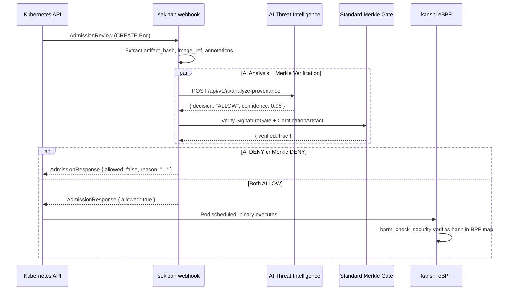

# AI Threat Intelligence API: Zero-Day Detection from Merkle-Structured Provenance

## 1. The Signal-to-Noise Solution

Traditional SAST tools analyze source code syntax. LLM-based tools scan for known vulnerability patterns in text. Both drown in false positives because they operate on unstructured data without provenance guarantees.

Tameshi's AI operates on a fundamentally different signal:

- **Input:** Not source code. Not syslogs. The Nix derivation dependency graph + BLAKE3 Merkle tree binding artifact hash, compliance hash, and intent hash.
- **Signal:** The exact structural DNA of the binary's entire dependency chain, cryptographically verified from source through build to deployment.
- **Why this catches zero-days:** When a new binary arrives, its dependency graph is compared against the structural fingerprints of every known breach. A zero-day in a transitive dependency produces a measurable structural similarity to historical breach patterns -- even if the specific CVE is unknown.

The model does not need to understand code. It understands dependency topology. And topology does not lie.

---

## 2. API Interface (The Contract)

### POST /api/v1/ai/analyze-provenance

**Purpose:** Analyze a binary's cryptographic provenance for zero-day threat indicators before admission.

**Request:**

```json
{
  "artifact_hash": "blake3:af1349b9f5f9a1a6a0404dea36dcc9499bcb25c9adc112b7cc9a93cae41f3262",
  "control_hash": "blake3:8c4f7e2d1a3b5c6d7e8f9a0b1c2d3e4f5a6b7c8d9e0f1a2b3c4d5e6f7a8b9c0d",
  "intent_hash": "blake3:1a2b3c4d5e6f7a8b9c0d1e2f3a4b5c6d7e8f9a0b1c2d3e4f5a6b7c8d9e0f1a2b",
  "composed_root": "blake3:deadbeefdeadbeefdeadbeefdeadbeefdeadbeefdeadbeefdeadbeefdeadbeef",
  "nix_derivation_graph": {
    "store_path": "/nix/store/abc123-myapp-1.0.0",
    "direct_dependencies": [
      "/nix/store/def456-openssl-3.3.1",
      "/nix/store/ghi789-glibc-2.39",
      "/nix/store/jkl012-libcurl-8.7.1"
    ],
    "transitive_dependency_count": 147,
    "closure_hash": "blake3:7f2e1d4c5b6a8907f2e1d4c5b6a89070a1b2c3d4e5f60708a1b2c3d4e5f60708",
    "build_inputs_hash": "blake3:0102030405060708090a0b0c0d0e0f101112131415161718191a1b1c1d1e1f20"
  },
  "deployment_context": {
    "cluster": "plo-us-east",
    "namespace": "production",
    "node": "node-04",
    "image_ref": "ghcr.io/pleme-io/myapp@sha256:abc123def456789..."
  },
  "requesting_component": "sekiban-webhook",
  "urgency": "admission"
}
```

**Request Fields:**

| Field | Type | Required | Description |
|-------|------|----------|-------------|
| `artifact_hash` | `string` | yes | BLAKE3 hash of the Nix store closure or OCI manifest (Leaf 0 of `CertificationArtifact`) |
| `control_hash` | `string` | yes | BLAKE3 hash of the kensa compliance assessment (Leaf 1) |
| `intent_hash` | `string` | yes | BLAKE3 hash of Pangea synthesis output (Leaf 2) |
| `composed_root` | `string` | yes | 3-leaf Merkle root with RFC 9162 domain separation |
| `nix_derivation_graph` | `object` | yes | Nix closure metadata -- the structural signal |
| `nix_derivation_graph.store_path` | `string` | yes | Nix store path of the top-level derivation |
| `nix_derivation_graph.direct_dependencies` | `string[]` | yes | Immediate Nix store dependencies |
| `nix_derivation_graph.transitive_dependency_count` | `integer` | yes | Total closure size |
| `nix_derivation_graph.closure_hash` | `string` | yes | BLAKE3 hash of the sorted closure (from `NixCollector`) |
| `nix_derivation_graph.build_inputs_hash` | `string` | yes | BLAKE3 hash of all build-time inputs |
| `deployment_context` | `object` | yes | Where this binary is being deployed |
| `deployment_context.cluster` | `string` | yes | Target cluster ID |
| `deployment_context.namespace` | `string` | yes | Target K8s namespace |
| `deployment_context.node` | `string` | no | Specific node (if known at admission time) |
| `deployment_context.image_ref` | `string` | yes | OCI image reference (must be `@sha256:` digest) |
| `requesting_component` | `string` | yes | Caller identity (`sekiban-webhook`, `inshou`, `kanshi`) |
| `urgency` | `string` | yes | `admission` (synchronous, <500ms) or `background` (async, best-effort) |

**Response (200 OK):**

```json
{
  "decision": "ALLOW",
  "confidence": 0.98,
  "analysis": {
    "structural_similarity_to_known_breaches": 0.02,
    "dependency_graph_anomaly_score": 0.01,
    "drift_from_baseline": 0.03,
    "novel_dependency_count": 0,
    "flagged_dependencies": []
  },
  "threat_intelligence": {
    "matched_patterns": [],
    "nearest_breach_id": null,
    "nearest_breach_similarity": 0.0,
    "recommended_action": "proceed"
  },
  "evidence": {
    "analysis_hash": "blake3:e3b0c44298fc1c149afbf4c8996fb92427ae41e4649b934ca495991b7852b855",
    "model_version": "tameshi-ai-v0.1.0",
    "analyzed_at": "2026-03-22T10:30:00Z",
    "inference_time_ms": 12
  }
}
```

**Response Fields:**

| Field | Type | Values | Description |
|-------|------|--------|-------------|
| `decision` | `string` | `ALLOW`, `DENY`, `WARN` | Gate verdict |
| `confidence` | `float` | 0.0--1.0 | Model confidence in the decision |
| `analysis.structural_similarity_to_known_breaches` | `float` | 0.0--1.0 | Cosine similarity between this binary's dependency graph embedding and the nearest known breach graph embedding |
| `analysis.dependency_graph_anomaly_score` | `float` | 0.0--1.0 | Isolation Forest anomaly score. >0.8 = highly anomalous |
| `analysis.drift_from_baseline` | `float` | 0.0--1.0 | Distance from the learned baseline for this application's dependency profile |
| `analysis.novel_dependency_count` | `integer` | >= 0 | Number of transitive dependencies never seen in any prior attestation |
| `analysis.flagged_dependencies` | `string[]` | Nix store paths | Dependencies contributing most to the anomaly score |
| `threat_intelligence.matched_patterns` | `object[]` | | Known breach patterns matched (see pattern schema below) |
| `threat_intelligence.nearest_breach_id` | `string?` | | Tameshi breach ID of the closest structural match, or null |
| `threat_intelligence.nearest_breach_similarity` | `float` | 0.0--1.0 | Similarity score to the nearest breach |
| `threat_intelligence.recommended_action` | `string` | `proceed`, `quarantine`, `investigate`, `block` | Recommended operator action |
| `evidence.analysis_hash` | `string` | | BLAKE3 hash of the full analysis payload (for `HeartbeatChain` recording) |
| `evidence.model_version` | `string` | | Model version that produced this analysis |
| `evidence.analyzed_at` | `string` | ISO 8601 | Timestamp of analysis completion |
| `evidence.inference_time_ms` | `integer` | | Wall-clock inference time |

**Matched Pattern Schema:**

```json
{
  "pattern_id": "TAMESHI-BREACH-2025-ROS2-DDS",
  "similarity": 0.942,
  "description": "ROS2 DDS middleware vulnerability chain",
  "affected_dependency_pattern": "fastdds-2.x",
  "first_observed": "2025-09-14T00:00:00Z"
}
```

**Error Responses:**

| Status | Condition | Body |
|--------|-----------|------|
| 400 | Invalid request (missing required fields, malformed hashes) | `{ "error": "invalid_request", "message": "..." }` |
| 422 | Hash format valid but does not match a known `CertificationArtifact` structure | `{ "error": "unprocessable", "message": "..." }` |
| 503 | Model not loaded or retraining in progress | `{ "error": "service_unavailable", "message": "...", "retry_after_ms": 5000 }` |

---

### GET /api/v1/ai/model-status

**Purpose:** Return the current model version, training data window, and health.

**Response (200 OK):**

```json
{
  "model_version": "tameshi-ai-v0.1.0",
  "status": "ready",
  "training_data": {
    "window_start": "2025-09-22T00:00:00Z",
    "window_end": "2026-03-22T00:00:00Z",
    "total_attestations_trained": 1284000,
    "breach_patterns_loaded": 47,
    "clusters_covered": 12
  },
  "performance": {
    "avg_inference_ms": 8,
    "p99_inference_ms": 45,
    "total_analyses_24h": 14200,
    "deny_count_24h": 0,
    "warn_count_24h": 3
  },
  "last_retrained": "2026-03-21T02:00:00Z",
  "next_retrain_scheduled": "2026-03-28T02:00:00Z"
}
```

| Field | Type | Description |
|-------|------|-------------|
| `status` | `string` | `ready`, `retraining`, `degraded`, `unavailable` |
| `training_data.total_attestations_trained` | `integer` | Number of `CertificationArtifact` entries used for training |
| `training_data.breach_patterns_loaded` | `integer` | Number of known breach structural fingerprints in the model |
| `performance.avg_inference_ms` | `integer` | Mean inference latency over the last 24 hours |
| `performance.p99_inference_ms` | `integer` | 99th percentile inference latency |

---

### POST /api/v1/ai/feedback

**Purpose:** Label a previous analysis as true-positive or false-positive for model retraining.

**Request:**

```json
{
  "analysis_hash": "blake3:e3b0c44298fc1c149afbf4c8996fb92427ae41e4649b934ca495991b7852b855",
  "label": "false_positive",
  "operator_id": "luis.d@pleme.io",
  "justification": "Dependency update was authorized via change request CR-2026-0147",
  "change_request_ref": "CR-2026-0147"
}
```

**Response (201 Created):**

```json
{
  "feedback_id": "fb-2026-03-22-001",
  "analysis_hash": "blake3:e3b0c44298fc1c149afbf4c8996fb92427ae41e4649b934ca495991b7852b855",
  "label": "false_positive",
  "recorded_at": "2026-03-22T11:00:00Z",
  "will_affect_retrain": true,
  "next_retrain": "2026-03-28T02:00:00Z"
}
```

| Field | Type | Values | Description |
|-------|------|--------|-------------|
| `label` | `string` | `true_positive`, `false_positive`, `true_negative`, `false_negative` | Operator's assessment |
| `justification` | `string` | | Free text reason (recorded in `HeartbeatChain`) |
| `change_request_ref` | `string?` | | Optional link to an external change management system |

---

## 3. Mock Responses

### Response A: Clean Binary (ALLOW)

A legitimate Nix-built binary with no threat indicators. All dependency graph metrics within normal bounds.

```json
{
  "decision": "ALLOW",
  "confidence": 0.98,
  "analysis": {
    "structural_similarity_to_known_breaches": 0.02,
    "dependency_graph_anomaly_score": 0.01,
    "drift_from_baseline": 0.03,
    "novel_dependency_count": 0,
    "flagged_dependencies": []
  },
  "threat_intelligence": {
    "matched_patterns": [],
    "nearest_breach_id": null,
    "nearest_breach_similarity": 0.0,
    "recommended_action": "proceed"
  },
  "evidence": {
    "analysis_hash": "blake3:a1b2c3d4e5f6a1b2c3d4e5f6a1b2c3d4e5f6a1b2c3d4e5f6a1b2c3d4e5f6a1b2",
    "model_version": "tameshi-ai-v0.1.0",
    "analyzed_at": "2026-03-22T14:00:00Z",
    "inference_time_ms": 7
  }
}
```

### Response B: Zero-Day Blocked (DENY)

A binary whose dependency graph shares 94.2% structural similarity with the ROS2 DDS breach pattern. The `fastdds-2.14.0` transitive dependency introduces a dependency subgraph that is structurally near-identical to the graph that enabled CVE-2025-XXXXX, even though this specific version was not in the original advisory.

```json
{
  "decision": "DENY",
  "confidence": 0.96,
  "analysis": {
    "structural_similarity_to_known_breaches": 0.942,
    "dependency_graph_anomaly_score": 0.87,
    "drift_from_baseline": 0.71,
    "novel_dependency_count": 3,
    "flagged_dependencies": [
      "/nix/store/xxx-fastdds-2.14.0",
      "/nix/store/yyy-foonathan-memory-0.7.3",
      "/nix/store/zzz-asio-1.28.0"
    ]
  },
  "threat_intelligence": {
    "matched_patterns": [
      {
        "pattern_id": "TAMESHI-BREACH-2025-ROS2-DDS",
        "similarity": 0.942,
        "description": "ROS2 DDS middleware vulnerability chain — memory corruption via malformed RTPS packets in Fast-DDS, exploitable through transitive dependency on foonathan-memory allocator",
        "affected_dependency_pattern": "fastdds-2.x + foonathan-memory-0.7.x",
        "first_observed": "2025-09-14T00:00:00Z"
      }
    ],
    "nearest_breach_id": "TAMESHI-BREACH-2025-ROS2-DDS",
    "nearest_breach_similarity": 0.942,
    "recommended_action": "block"
  },
  "reason": "Dependency graph structural analysis detected 94.2% similarity to breach pattern TAMESHI-BREACH-2025-ROS2-DDS. The transitive dependency chain /nix/store/xxx-fastdds-2.14.0 -> /nix/store/yyy-foonathan-memory-0.7.3 -> /nix/store/zzz-asio-1.28.0 reproduces the exact memory allocator topology that enabled the ROS2 DDS exploit. The specific version (fastdds-2.14.0) was not in the original CVE advisory, but its dependency graph is structurally equivalent to the known-vulnerable 2.13.x series. This is a zero-day structural match: the vulnerability likely exists in this version but has not been publicly disclosed.",
  "evidence": {
    "analysis_hash": "blake3:f0e1d2c3b4a5f0e1d2c3b4a5f0e1d2c3b4a5f0e1d2c3b4a5f0e1d2c3b4a5f0e1",
    "model_version": "tameshi-ai-v0.1.0",
    "analyzed_at": "2026-03-22T14:02:31Z",
    "inference_time_ms": 23
  }
}
```

### Response C: Elevated Anomaly (WARN)

A binary that has elevated anomaly scores but does not match any known breach pattern. The model is uncertain -- the dependency graph has changed significantly from its baseline, but the changes do not structurally resemble any catalogued attack.

```json
{
  "decision": "WARN",
  "confidence": 0.73,
  "analysis": {
    "structural_similarity_to_known_breaches": 0.31,
    "dependency_graph_anomaly_score": 0.64,
    "drift_from_baseline": 0.52,
    "novel_dependency_count": 8,
    "flagged_dependencies": [
      "/nix/store/aaa-new-crypto-lib-0.1.0",
      "/nix/store/bbb-experimental-allocator-2.0.0"
    ]
  },
  "threat_intelligence": {
    "matched_patterns": [],
    "nearest_breach_id": "TAMESHI-BREACH-2025-LOG4SHELL-VARIANT",
    "nearest_breach_similarity": 0.31,
    "recommended_action": "investigate"
  },
  "reason": "Dependency graph contains 8 novel transitive dependencies not seen in any prior attestation for this application. Anomaly score 0.64 exceeds the warning threshold (0.50) but is below the deny threshold (0.80). No known breach pattern matched above 0.50 similarity. The novel dependencies include an unpublished cryptography library (new-crypto-lib-0.1.0) and an experimental memory allocator. Manual review recommended before promotion to production.",
  "evidence": {
    "analysis_hash": "blake3:1122334455667788990011223344556677889900112233445566778899001122",
    "model_version": "tameshi-ai-v0.1.0",
    "analyzed_at": "2026-03-22T14:05:12Z",
    "inference_time_ms": 19
  }
}
```

---

## 4. Webhook Integration Flow



**Key design decision:** The AI analysis runs IN PARALLEL with the standard Merkle gate verification. This means:

- The AI does not add latency to the critical path (both run concurrently).
- Either gate can veto admission (defense in depth).
- The AI is advisory in WARN mode but authoritative in DENY mode.
- If the AI service is unavailable, the standard Merkle gate continues to function (fail-safe: AI unavailable does not equal AI allows).

### Detailed sekiban Integration Point

The AI call is inserted into the `validate_handler` flow in `sekiban/src/webhook/admission.rs`, after `evaluate_gate()` returns and before the final `AdmissionResponse` is constructed. The parallel execution model:

```
validate_handler() receives AdmissionReview
    |
    +-- tokio::join!(
    |       evaluate_gate(client, namespace, ...),       // existing Merkle gate
    |       ai_client.analyze_provenance(provenance_req) // new AI gate
    |   )
    |
    +-- merge decisions:
    |       if ai_decision == DENY || gate_decision == Deny -> DENY
    |       if ai_decision == WARN && gate_decision == Allow -> ALLOW + log warning
    |       if ai_decision == ALLOW && gate_decision == Allow -> ALLOW
    |
    +-- record to HeartbeatChain (includes AI analysis_hash in entry metadata)
    |
    +-- return AdmissionResponse
```

The `WebhookState` struct gains an `ai_client: Option<Arc<dyn AiThreatClient>>` field. When `None`, the AI gate is skipped entirely -- the system degrades gracefully to Merkle-only verification.

### HeartbeatChain Recording

Every AI analysis is recorded in the `HeartbeatChain` with event type `AdmissionDecision`. The entry includes:

- The standard admission fields (resource_id, operation, allowed/denied)
- The `analysis_hash` from the AI response (linking to the full analysis)
- The `model_version` for audit traceability
- The `confidence` score
- The `decision` (ALLOW/DENY/WARN)

This creates an auditable record of every AI-driven decision. The `analysis_hash` enables deterministic replay: given the same `composed_root` and `nix_derivation_graph`, the same model version must produce the same `analysis_hash`.

### CryptographicReceipt Extension

The `CertificationArtifact` gains an optional `ai_analysis_hash` field in `DeploymentContext`:

```json
{
  "cluster": "plo-us-east",
  "namespace": "production",
  "node": "node-04",
  "pod": "myapp-7f8c9d-abc12",
  "container": "myapp",
  "image_ref": "ghcr.io/pleme-io/myapp@sha256:abc123...",
  "binary_paths": ["/app/myapp"],
  "sdlc_chain_hash": "blake3:...",
  "compliance_report_hash": "blake3:...",
  "ai_analysis_hash": "blake3:f0e1d2c3b4a5..."
}
```

This binds the AI analysis to the deployment record. Auditors can trace from any deployed binary to the exact AI analysis that cleared it.

---

## 5. Timeout and Fallback Behavior

| AI Response | Timeout (>500ms) | Error (5xx) | Connection Refused |
|-------------|-------------------|-------------|-------------------|
| ALLOW | Standard gate decides | Standard gate decides | Standard gate decides |
| WARN | Standard gate decides + log warning | Standard gate decides + log degraded | Standard gate decides |
| DENY | DENY (cached for 5 min) | DENY (cached for 5 min) | Standard gate decides |

The AI service failure mode is **fail-open for ALLOW, fail-closed for DENY**.

### Deny Cache

If the AI previously denied a specific `composed_root`, that denial is cached in sekiban's in-process LRU cache (keyed by `composed_root`, TTL 5 minutes). This ensures:

1. If the AI service goes down after issuing a DENY, the denial persists for 5 minutes.
2. Repeated admission attempts for the same binary do not require a round-trip to the AI service.
3. After TTL expiry, the standard Merkle gate is the sole authority until the AI service recovers.

### Latency Budget

The Kubernetes webhook timeout is 3 seconds (configured in `sekiban.yaml`). The AI service must respond within 500ms to leave headroom for the parallel Merkle gate verification and response serialization.

| Component | Budget |
|-----------|--------|
| AI inference | < 500ms |
| Merkle gate verification | < 200ms |
| Network overhead + serialization | < 300ms |
| Safety margin | 2000ms |
| **Total** | **3000ms** |

If the AI service exceeds 500ms, sekiban cancels the AI future via `tokio::time::timeout` and proceeds with the Merkle gate result alone. The cancellation is recorded as a `HeartbeatEvent` with outcome `Skipped` and reason `ai_timeout`.

---

## 6. Data Flow for Mock Theater Demo

Step-by-step sequence for demonstrating the AI Threat Intelligence gate in a controlled environment.

### Prerequisites

- sekiban webhook running with `ai_client` configured to point at `http://localhost:9090`
- Mock AI server binary (`tameshi-ai-mock`) listening on port 9090
- A K8s cluster with at least one namespace configured with a `SignatureGate`
- kanshi eBPF enforcement active on at least one node

### Step 1: Start the Mock AI Server

```bash
tameshi-ai-mock --port 9090 --default-response allow
```

The mock server returns Response A (ALLOW, confidence 0.98) for all requests by default.

### Step 2: Deploy a Legitimate Pod

```bash
kubectl apply -f deploy/demo-legitimate-pod.yaml
```

Observe the flow:

1. K8s API sends `AdmissionReview` to sekiban
2. sekiban calls mock AI at `POST /api/v1/ai/analyze-provenance`
3. Mock AI returns `{ "decision": "ALLOW", "confidence": 0.98, ... }`
4. Merkle gate verifies `SignatureGate` + `CertificationArtifact`
5. Both gates ALLOW
6. Pod is admitted and scheduled
7. kanshi verifies binary hash at `execve()` via `bprm_check_security`

### Step 3: Inject the Breach Pattern

Switch the mock AI to return Response B (DENY):

```bash
curl -X POST http://localhost:9090/mock/set-response \
  -H "Content-Type: application/json" \
  -d '{"mode": "deny", "breach_id": "TAMESHI-BREACH-2025-ROS2-DDS"}'
```

### Step 4: Deploy the Rogue Pod

```bash
kubectl apply -f deploy/demo-rogue-pod.yaml
```

Observe the flow:

1. K8s API sends `AdmissionReview` to sekiban
2. sekiban calls mock AI at `POST /api/v1/ai/analyze-provenance`
3. Mock AI returns `{ "decision": "DENY", "confidence": 0.96, "analysis": { "structural_similarity_to_known_breaches": 0.942, ... } }`
4. AI gate vetoes admission -- sekiban does not wait for the Merkle gate
5. `AdmissionResponse { allowed: false, reason: "AI Threat Intelligence: 94.2% structural similarity to breach TAMESHI-BREACH-2025-ROS2-DDS" }`
6. Pod creation is rejected

### Step 5: Inspect the CryptographicReceipt

```bash
kubectl get heartbeatchain -n production -o json | jq '.entries[-1]'
```

The last `HeartbeatEntry` shows:

- `event`: `AdmissionDecision`
- `result`: `Denied`
- `resource`: `production/Pod/demo-rogue-pod`
- `signature_checked`: `true`
- Metadata includes `ai_analysis_hash`, `model_version`, `confidence`, `nearest_breach_id`

### Step 6: Inspect the HeartbeatChain

```bash
curl http://localhost:8080/api/v1/heartbeat/entries?event=AdmissionDecision&result=Denied
```

The response contains the full chain of denial events, each with:

- The `analysis_hash` linking to the AI analysis
- The `composed_root` of the denied binary
- The `evidence_hash` of the full analysis payload
- Chain integrity: `previous_hash` links prove no entries were removed

### Step 7: Return to Normal

```bash
curl -X POST http://localhost:9090/mock/set-response \
  -H "Content-Type: application/json" \
  -d '{"mode": "allow"}'
```

The deny cache in sekiban will expire after 5 minutes. Subsequent legitimate deployments proceed normally.

---

## Appendix A: AiThreatClient Trait

```rust
/// Client interface for the AI Threat Intelligence service.
///
/// Implementations: `LiveAiThreatClient` (HTTP), `MockAiThreatClient` (testing).
#[async_trait::async_trait]
pub trait AiThreatClient: Send + Sync {
    /// Analyze a binary's provenance for zero-day threat indicators.
    async fn analyze_provenance(
        &self,
        request: &AnalyzeProvenanceRequest,
    ) -> Result<AnalyzeProvenanceResponse, AiThreatError>;

    /// Get the current model status.
    async fn model_status(&self) -> Result<ModelStatus, AiThreatError>;

    /// Submit operator feedback on a previous analysis.
    async fn submit_feedback(
        &self,
        feedback: &AnalysisFeedback,
    ) -> Result<FeedbackAck, AiThreatError>;
}
```

## Appendix B: Decision Thresholds

| Metric | ALLOW | WARN | DENY |
|--------|-------|------|------|
| `structural_similarity_to_known_breaches` | < 0.50 | 0.50--0.80 | > 0.80 |
| `dependency_graph_anomaly_score` | < 0.50 | 0.50--0.80 | > 0.80 |
| `drift_from_baseline` | < 0.60 | 0.60--0.85 | > 0.85 |
| `novel_dependency_count` | < 5 | 5--15 | > 15 |

The final decision is the MOST RESTRICTIVE outcome across all metrics. If any single metric exceeds its DENY threshold, the decision is DENY regardless of other metrics.

## Appendix C: Breach Pattern Registry

Breach patterns are stored as structural graph embeddings with metadata:

```json
{
  "breach_id": "TAMESHI-BREACH-2025-ROS2-DDS",
  "description": "ROS2 DDS middleware vulnerability chain",
  "cve_refs": ["CVE-2025-XXXXX"],
  "graph_embedding": [0.12, -0.34, 0.56, ...],
  "dependency_signature": {
    "required_nodes": ["fastdds-2.x", "foonathan-memory-0.7.x"],
    "required_edges": [["fastdds", "foonathan-memory"], ["fastdds", "asio"]],
    "minimum_similarity": 0.80
  },
  "severity": "critical",
  "first_observed": "2025-09-14T00:00:00Z",
  "source": "tameshi-watch CVE ingestion + manual structural analysis"
}
```

New breach patterns are added when tameshi-watch ingests a CVE (from any of its 7 sources) that affects a dependency with a known Nix closure. The structural fingerprint is computed from the Nix dependency graph of the affected package, not from the CVE text. This means the pattern matches structurally similar packages even if they are not named in the advisory.
