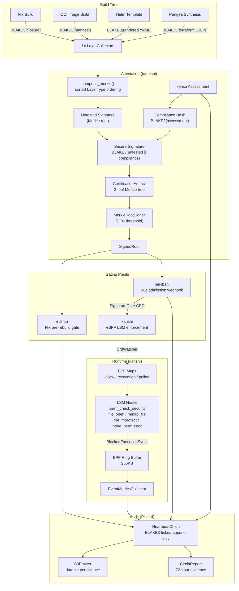
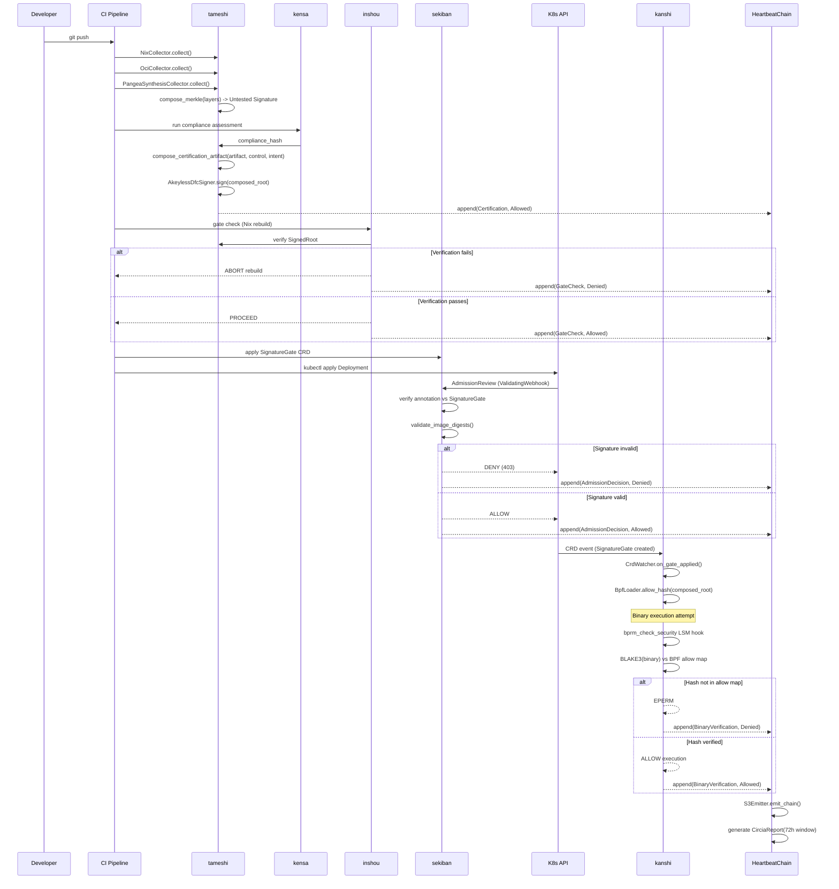

# Architecture

## System Overview



---

## 1. Recursive Attestation Model: CertificationArtifact

The `CertificationArtifact` (`src/certification_artifact.rs`) binds three sources of truth into a single 256-bit cryptographic commitment using a 3-leaf Merkle tree with RFC 9162 domain separation.

### Leaf Structure

| Leaf Index | Field | Source | Content |
|:----------:|-------|--------|---------|
| 0 | `artifact_hash` | `NixCollector` / `OciCollector` | `BLAKE3(Nix store closure)` or `BLAKE3(OCI manifest digest)` |
| 1 | `control_hash` | `kensa` / `RSpecResultCollector` / `InSpecResultCollector` | `BLAKE3(compliance assessment result)` |
| 2 | `intent_hash` | `PangeaSynthesisCollector` | `BLAKE3(Pangea deterministic Terraform JSON)` |

### Merkle Construction

```
Leaf hash:          BLAKE3(0x00 ∥ data)        -- RFC 9162 leaf domain
Internal node hash: BLAKE3(0x01 ∥ left ∥ right) -- RFC 9162 internal domain

                    composed_root
                    /            \
            internal_01          leaf_2 (intent)
            /          \
    leaf_0 (artifact)  leaf_1 (control)
```

Domain separation prevents second-preimage attacks where an attacker presents an internal node hash as a valid leaf. The `Blake3Algorithm` type in `src/merkle.rs` enforces this at the type level by injecting the `0x01` byte prefix in `concat_and_hash()`. The `domain_separated_leaf()` function injects the `0x00` prefix before leaves enter the tree.

### Key Types

```rust
pub struct CertificationArtifact {
    pub binary_path: String,          // Path to the certified binary
    pub artifact_hash: Blake3Hash,    // Leaf 0
    pub control_hash: Blake3Hash,     // Leaf 1
    pub intent_hash: Blake3Hash,      // Leaf 2
    pub composed_root: Blake3Hash,    // 3-leaf Merkle root
    pub proof_paths: ArtifactProofPaths, // Inclusion proofs per leaf
    pub environment: String,
    pub computed_at: DateTime<Utc>,
}
```

`binary_hash()` returns `composed_root` -- the single hash that populates the BPF allow map.

### Proof Paths

Each leaf has an inclusion proof of exactly 2 nodes (`ceil(log2(3))`). `verify_certification_artifact()` recomputes the tree from the three input hashes and verifies the root matches, then independently verifies each leaf's inclusion proof via `verify_proof_path()`.

### Verification

```rust
// Recompute: rebuild tree from inputs, compare root
// Prove: verify each leaf's Merkle inclusion proof independently
pub fn verify_certification_artifact(artifact: &CertificationArtifact) -> bool
```

Changing any single input hash changes the `composed_root`. The root cannot be forged without knowledge of all three inputs.

---

## 2. Threshold Signing

### Signer Implementations

| Signer | Key Management | Algorithm | Use Case |
|--------|---------------|-----------|----------|
| `LocalSigner` | 32-byte seed on disk | BLAKE3 keyed MAC (`H(seed ∥ data)`) | Development, testing |
| `AkeylessDfcSigner` | Akeyless DFC API | Threshold signing (key never assembled) | Production |
| `MockDfcSigner` | XOR of two 32-byte fragments | `BLAKE3(fragment_a XOR fragment_b)` | CI/CD, integration tests |

### MerkleRootSigner Trait

```rust
pub trait MerkleRootSigner: Send + Sync {
    async fn sign(&self, root: &Blake3Hash) -> Result<SignedRoot>;
    async fn verify(&self, signed: &SignedRoot) -> Result<bool>;
}
```

### MockDfcSigner Split-Knowledge

```
Fragment A: loaded from .tameshi_frag file (hex-encoded)
Fragment B: loaded from AKEYLESS_MOCK_FRAG env var (hex-encoded)

Key = BLAKE3(fragment_a XOR fragment_b)

Properties:
- XOR of two independent 256-bit values is a one-time pad
- Given only one fragment, key has 256 bits of uncertainty
- BLAKE3 post-processing ensures uniform key distribution
- Debug output prints [REDACTED] for both fragments
```

### AkeylessDfcSigner

Calls `/sign-data-with-classic-key` on the Akeyless gateway REST API. The gateway performs the threshold signing internally -- the complete key never leaves the secure enclave. Supports mTLS via `TlsConfig` (pinned CA, client certificates). Authentication via API key (`/auth` endpoint).

### BreakGlassToken

Emergency bypass when the attestation system is unavailable. Every activation is:

- Cryptographically signed (BLAKE3 keyed MAC of all token fields)
- Scoped to specific namespaces (or wildcard `*`)
- Time-bounded (`valid_from`, `valid_until`)
- Recorded as `HeartbeatEvent::BreakGlass` in the heartbeat chain
- Subject to the 72-hour CIRCIA reporting window

### SignedRoot

```rust
pub struct SignedRoot {
    pub root: Blake3Hash,
    pub signature: Vec<u8>,
    pub algorithm: SigningAlgorithm,  // Ed25519Local | AkeylessDfc | MockDfc | BreakGlass
    pub signer_id: String,
    pub signed_at: DateTime<Utc>,
}
```

---

## 3. Five Gating Points

### 3.1 inshou -- Nix Pre-Rebuild Gate

Intercepts `nixos-rebuild switch` or `darwin-rebuild switch`. Computes `BLAKE3(new system closure)`, queries the tameshi API for the expected `SignedRoot`, verifies. If verification fails, the rebuild is aborted. No fallback paths -- fail-secure by design.

Architecture: `App<N,C,P,K,F>` -- 5 generic trait parameters for full testability without real Nix, network, or filesystem. 457 tests.

### 3.2 sekiban -- K8s ValidatingAdmissionWebhook

Intercepts every K8s API write operation. Fail-closed with `failurePolicy: Fail`.

Gate evaluation flow:

1. List `SignatureGate` CRDs in the resource's namespace
2. Filter to gates targeting this resource kind and operation
3. For each applicable gate, extract `sekiban.pleme.io/signature` annotation from the object
4. Verify annotation matches the gate's `expectedSignature`
5. If namespace has `tameshi.pleme.io/require-digest=true`, call `validate_image_digests()` -- rejects mutable tags, requires `@sha256:` / `@sha384:` / `@sha512:` digest references
6. Verify changeset hash for UPDATE/PATCH operations
7. Record decision to HeartbeatChain via `HeartbeatRecorder`
8. Emit Prometheus metrics

```rust
// TOCTOU mitigation (3 layers):
// 1. OCI digest enforcement -- immutable image references
// 2. K8s spec immutability -- container images cannot change after Pod creation
// 3. kanshi LSM hooks -- content hash verified at execve() time
```

Timeout: 3 seconds (Kubernetes webhook timeout default). If the webhook is unreachable, the API server denies the request (`failurePolicy: Fail`).

417 tests. 3 CRDs: `SignatureGate`, `Certification`, `CompliancePolicy`.

### 3.3 kanshi -- eBPF LSM Enforcement

See Section 5.

### 3.4 kensa -- Compliance Assessment

Runs compliance assessments through the `CompliancePlugin` trait:

```rust
pub trait CompliancePlugin: Send + Sync {
    fn domain(&self) -> &str;
    fn nist_families(&self) -> Vec<String>;
    fn generate_controls(&self, config: &PluginConfig) -> Vec<ComplianceControl>;
    async fn evaluate(&self, controls: &[ComplianceControl], config: &PluginConfig)
        -> Result<DomainEvaluation>;
    fn is_available(&self) -> bool;
}
```

4 domain plugins:

| Domain | Controls | NIST Families |
|--------|:--------:|---------------|
| Kernel | 20 | SC, CM |
| Nix Store | 15 | CM, SI |
| OCI | 15 | SI, SR |
| Kubernetes | 20 | AC, CM, SI |

`ComplianceOrchestrator` discovers plugins via `PluginRegistry`, invokes each, aggregates into `FullComplianceReport`. The report's `compliance_hash` = `BLAKE3(per-domain evaluation hashes)`. This hash becomes Leaf 1 of the `CertificationArtifact`.

546 tests. OSCAL 1.1.2 output generation. Two-phase certification pipeline (untested -> secure).

### 3.5 HeartbeatChain -- Tamper-Evident Audit Trail

See Section 8.

---

## 4. SDLC Chain

Eight phases mirror the complete delivery pipeline (`src/sdlc.rs`):

```
SourceCommit --> CiBuild --> NixEvaluation --> ContainerBuild
    --> HelmPackage --> GitOpsSync --> K8sAdmission --> RuntimeExecution
```

`SdlcChain` accumulates `SdlcCheckpoint` entries, each containing the phase, a BLAKE3 `output_hash`, gate pass/fail status, and a timestamp. The composite `chain_hash` = `BLAKE3(checkpoint_0_hash ∥ checkpoint_1_hash ∥ ... ∥ checkpoint_n_hash)`.

```rust
pub struct SdlcChain {
    pub deployment_id: String,
    pub checkpoints: Vec<SdlcCheckpoint>,
    pub chain_hash: Blake3Hash,
    pub all_gates_passed: bool,
}
```

`is_complete()` verifies all 8 phases are present. `to_layer_signature()` converts the chain into a `LayerSignature` for Merkle tree integration. The `chain_hash` feeds directly into `compose_certification_artifact()` as the `artifact_hash`.

---

## 5. eBPF Enforcement (kanshi)

### Architecture

```
Kubernetes API Server
    │ (SignatureGate CRDs)
    │ kube-rs watcher
    ▼
kanshi (userspace daemon)
    │
    ├── CrdWatcher<BpfLoader>
    │   ├── on_gate_applied() → BpfLoader.allow_hash()
    │   └── on_gate_deleted() → BpfLoader.remove_hash()
    │
    ├── HashVerifier
    │   ├── allow(inode, hash) → inode-based fast path
    │   ├── verify_by_hash(hash) → content-hash path (inode-reuse-immune)
    │   └── revoke(hash) → revocation takes priority
    │
    └── PolicyEngine
        └── per-namespace EnforcementPolicy (Audit / Enforce / AllowUnknown)
    │
    │ BPF syscall
    ▼
kanshi-ebpf (kernel space)
    ├── bprm_check_security  → binary verification at execve()
    ├── file_open            → script/config verification
    ├── mmap_file            → shared library verification (dlopen/JIT)
    ├── file_mprotect        → Write XOR Execute enforcement
    └── inode_permission     → procfs/sysfs write masking
```

### BPF Map Layout

| Map | Key | Value | Purpose |
|-----|-----|-------|---------|
| `tameshi_allow_map` | `BpfHash([u8; 32])` | `u8(1)` | Allowed binary hashes |
| `tameshi_revocation_list` | `BpfHash([u8; 32])` | `u8(1)` | Revoked hashes |
| `tameshi_policy_map` | `namespace_hash(u32)` | `EnforcementPolicy` | Per-namespace policy |
| `tameshi_events` | -- | `ringbuf(256KB)` | Kernel-to-userspace events |

### LSM Hook Decision Flow

```
execve("./my-binary")
    └── bprm_check_security (LSM hook)
        ├── compute BLAKE3 hash of binary content
        ├── lookup in tameshi_revocation_list
        │   └── FOUND → DENY (EPERM)
        ├── lookup in tameshi_allow_map
        │   └── FOUND → ALLOW
        └── lookup tameshi_policy_map for namespace
            ├── Enforce    → DENY (EPERM) + emit BlockedExecutionEvent
            ├── Audit      → ALLOW + emit event to ring buffer
            └── AllowUnknown → ALLOW
```

Revocation is checked before the allow map. This prevents a race where a revoked binary is executed before the revocation map update propagates.

### Inode Reuse Fix

`HashVerifier.verify()` uses inode-based lookup as a performance optimization. But inodes can be reused: a file is deleted, a new file is created with the same inode but different content. The inode lookup returns the old expected hash, which does not match the new content hash, yielding `VerifyResult::Mismatch` in Enforce mode.

For inode-reuse-immune verification, `verify_by_hash()` checks the content hash directly against the allow set, bypassing inode lookup entirely:

```rust
pub fn verify_by_hash(&self, hash: &BpfHash) -> VerifyResult {
    if self.revocation_map.contains(hash) { return VerifyResult::Revoked; }
    if self.allow_set.contains(hash) { return VerifyResult::Allowed; }
    VerifyResult::Unknown
}
```

### enforce_or_fail()

If BPF LSM is not available and the policy is `Enforce`, kanshi returns a hard error and refuses to run. This prevents silent security downgrade where kanshi appears active but is not actually enforcing:

```rust
pub fn enforce_or_fail(lsm_available: bool, policy: EnforcementPolicy) -> Result<(), Error> {
    if policy == EnforcementPolicy::Enforce && !lsm_available {
        Err(Error::Bpf("SECURITY: Enforce mode requires BPF LSM..."))
    } else { Ok(()) }
}
```

135 tests. `MockBpfLoader` and `FailableBpfLoader` (chaos testing: map full, load failure, corrupt lookups) for macOS development. Cross-compile model: userspace compiles and tests natively on macOS, eBPF programs cross-compiled in Linux CI.

---

## 6. GatingPolicy

```rust
pub struct GatingPolicy {
    pub name: String,
    pub required_layers: Vec<String>,
    pub require_compliance: bool,
    pub max_signature_age_secs: Option<u64>,  // Default: 3600 (1 hour)
    pub fail_open: bool,                      // Default: false (fail closed)
    pub require_certification_artifacts: bool, // Default: false
}
```

`evaluate_gate_with_clock()` checks:

1. Compliance hash present (if `require_compliance`)
2. CertificationArtifacts valid (if `require_certification_artifacts`) -- non-empty, all pass `verify_certification_artifact()`, at least one has non-zero `intent_hash`
3. Signature age within `max_signature_age_secs` (using injected `Clock` for deterministic testing)
4. All `required_layers` present in `MasterSignature`
5. Signature hash matches expected
6. Internal Merkle root recomputation succeeds (`verify_untested()`, `verify_secure()`)

---

## 7. Compliance Plugin Architecture

### CompliancePlugin Trait

```rust
pub trait CompliancePlugin: Send + Sync {
    fn domain(&self) -> &str;              // "kernel", "nix-store", "oci", "kubernetes"
    fn nist_families(&self) -> Vec<String>; // ["SC", "CM", "SI", ...]
    fn generate_controls(&self, config: &PluginConfig) -> Vec<ComplianceControl>;
    fn evaluate(&self, controls: &[ComplianceControl], config: &PluginConfig)
        -> Pin<Box<dyn Future<Output = Result<DomainEvaluation>> + Send + '_>>;
    fn is_available(&self) -> bool;
}
```

Trait is `dyn`-safe. `ComplianceOrchestrator` discovers and invokes plugins via `PluginRegistry`.

### Domain Evaluation

Each plugin evaluation produces a `DomainEvaluation`:

```rust
pub struct DomainEvaluation {
    pub domain: String,
    pub evaluations: Vec<ControlEvaluation>,
    pub domain_hash: Blake3Hash,  // BLAKE3(domain + control_ids + pass_status + evidence_hashes)
    pub completed_at: DateTime<Utc>,
    pub total_duration_ms: u64,
    pub all_required_passed: bool,
}
```

### Control Severity

5 levels: `Info < Low < Medium < High < Critical`. Controls marked `required: true` must pass for the domain evaluation to pass. Advisory controls are logged but do not block.

---

## 8. HeartbeatChain (Tamper-Evident Audit Trail)

### Chain Structure

```
Entry_0  ──hash──>  Entry_1  ──hash──>  Entry_2  ──hash──>  Entry_n
  │                   │                   │                   │
  ├─ verifier         ├─ verifier         ├─ verifier         ├─ verifier
  ├─ event            ├─ event            ├─ event            ├─ event
  ├─ result           ├─ result           ├─ result           ├─ result
  └─ prev: 0..0       └─ prev: H(E_0)    └─ prev: H(E_1)    └─ prev: H(E_{n-1})
```

`entry_hash` = `BLAKE3(sequence ∥ timestamp ∥ verifier ∥ event ∥ result ∥ resource ∥ signature_checked ∥ previous_hash)`

### Thread Safety

`HeartbeatChain` wraps `HeartbeatChainInner` in `RwLock`. Concurrent reads, exclusive writes. All public methods acquire the lock automatically.

### 14 Event Types

`AdmissionDecision`, `GateVerification`, `ComplianceAssessment`, `Certification`, `GateCheck`, `BinaryVerification`, `ScriptVerification`, `BreakGlass`, `Revocation`, `IacTestInit`, `IacTestApply`, `IacTestVerify`, `IacTestTeardown`, `IacTestSuiteComplete`

### 4 Outcomes

`Allowed`, `Denied`, `Skipped`, `Error`

### ConsistencyProof

CT-style proof between two chain states. Given `from_seq` and `to_seq`, produces proof nodes demonstrating the chain at `to_seq` is a valid extension of the chain at `from_seq`. Enables incremental auditing without downloading the entire chain.

### S3Emitter

Persists chain entries to S3-compatible storage via the `object_store` crate. Implements `HeartbeatEmitter` trait.

---

## 9. Continuous Compliance Ingestion (tameshi-watch)

### 7 Sources

| Source | Data | Ingestion Method |
|--------|------|-----------------|
| NVD | CVE database | REST API poll |
| OSV | Open Source Vulnerabilities | REST API poll |
| GitHub Advisory | GitHub Security Advisories | GraphQL API |
| Rust Advisory | rustsec/advisory-db | Git clone + parse |
| Nix vulnix | Nix-specific vulnerability scanner | Subprocess |
| MITRE SAF | STIG/CIS InSpec profiles | Git clone + transpile |
| dev-sec.io | Hardening baselines | Git clone + transpile |

### Pipeline

```
Source poll → EventPipeline
    ├── Dedup (by CVE ID / advisory ID)
    ├── Severity filter (configurable threshold)
    ├── kensa ingestion (new compliance controls)
    └── kanshi revocation (BPF revocation list update for affected binaries)
```

144 tests.

---

## 10. End-to-End Sequence


