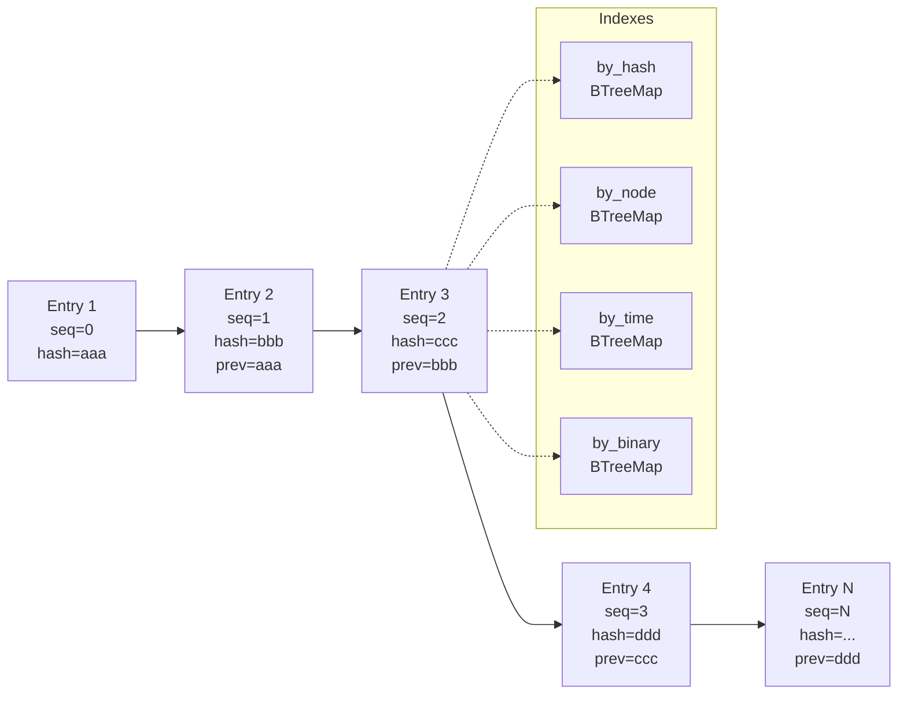
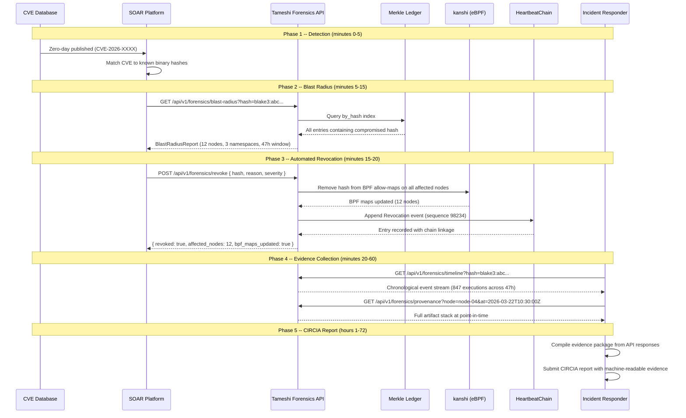

# Forensics and Incident Response API

API-first incident response for the tameshi attestation platform. All endpoints
operate against the MerkleLedger -- the append-only, tamper-proof history of every
CertificationArtifact ever produced.

---

## 1. Blast Radius REST API

### GET /api/v1/forensics/blast-radius

Query the historical ledger for every deployment that contained a compromised hash.

**Query parameters**:

| Parameter | Type | Required | Default | Description |
|-----------|------|----------|---------|-------------|
| `hash` | string | yes | -- | BLAKE3 hash of compromised artifact (prefixed: `blake3:abc...`) |
| `from` | datetime | no | 72 hours ago | Start of time window |
| `to` | datetime | no | now | End of time window |

**Response 200**:

```json
{
  "query_hash": "blake3:abc...",
  "total_affected": 12,
  "time_range": {
    "first_seen": "2026-03-20T14:30:00Z",
    "last_seen": "2026-03-22T08:15:00Z"
  },
  "affected_nodes": [
    {
      "node": "node-04",
      "cluster": "plo",
      "first_execution": "2026-03-20T14:30:00Z",
      "last_execution": "2026-03-22T08:15:00Z",
      "execution_count": 847,
      "pods": ["app-7b9d4-abc12", "worker-3f8a2-def34"],
      "namespaces": ["production", "batch"]
    }
  ],
  "co_resident_artifacts": [
    {
      "composed_root": "blake3:def...",
      "artifact_hash": "blake3:ghi...",
      "control_hash": "blake3:jkl...",
      "intent_hash": "blake3:mno...",
      "binary_path": "/nix/store/xyz-app/bin/app"
    }
  ],
  "merkle_proof": {
    "leaf_index": 0,
    "proof_nodes": ["blake3:...", "blake3:..."]
  },
  "chain_integrity": true,
  "evidence_hash": "blake3:pqr..."
}
```

### GET /api/v1/forensics/timeline

Chronological event stream for a specific hash across the ledger.

**Query parameters**:

| Parameter | Type | Required | Default | Description |
|-----------|------|----------|---------|-------------|
| `hash` | string | yes | -- | BLAKE3 hash to trace |
| `from` | datetime | no | 72 hours ago | Start of time window |
| `to` | datetime | no | now | End of time window |
| `node` | string | no | -- | Filter to a specific node |

**Response 200**:

```json
{
  "events": [
    {
      "timestamp": "2026-03-20T14:30:00Z",
      "event_type": "binary_verification",
      "decision": "ALLOW",
      "node": "node-04",
      "pod": "app-7b9d4-abc12",
      "binary_path": "/nix/store/xyz-app/bin/app",
      "composed_root": "blake3:def...",
      "sequence": 14523
    }
  ]
}
```

### GET /api/v1/forensics/provenance

Point-in-time snapshot of all active artifacts on a node.

**Query parameters**:

| Parameter | Type | Required | Description |
|-----------|------|----------|-------------|
| `node` | string | yes | Node name to query |
| `at` | datetime | yes | Point-in-time timestamp |

**Response 200**:

```json
{
  "node": "node-04",
  "timestamp": "2026-03-22T10:30:00Z",
  "active_artifacts": [
    {
      "certification_artifact": { "...full CertificationArtifact..." },
      "signed_root": { "...SignedRoot..." },
      "deployment_context": { "...DeploymentContext..." }
    }
  ]
}
```

### POST /api/v1/forensics/revoke

Emergency revocation of a compromised hash. Updates kanshi BPF maps to block
execution and records a Revocation event in the HeartbeatChain.

**Request body**:

```json
{
  "hash": "blake3:abc...",
  "reason": "CVE-2026-XXXX",
  "severity": "critical",
  "operator": "incident-responder@org.com"
}
```

**Response 200**:

```json
{
  "revoked": true,
  "affected_nodes": 12,
  "bpf_maps_updated": true,
  "heartbeat_entry_sequence": 98234
}
```

---

## 2. Data Ledger Mechanics

The MerkleLedger is an append-only, BLAKE3-chained log of every
CertificationArtifact produced by the system. Each entry includes:

- The full CertificationArtifact (3-leaf Merkle: provenance + compliance + intent)
- The SignedRoot (Ed25519 or Akeyless DFC signature)
- The DeploymentContext (cluster, namespace, node, pod, container, binary paths)
- A BLAKE3 hash of all fields (entry_hash)
- A pointer to the previous entry's hash (chain linkage)



**Tamper detection**: Any modification to a historical entry breaks the hash chain.
The ConsistencyProof API (inherited from HeartbeatChain) enables external auditors
to verify chain integrity without downloading the full ledger.

---

## 3. Incident Response Workflow

End-to-end flow from CVE disclosure to automated remediation:



---

## 4. Retention and Compliance

### CIRCIA 72-Hour Reporting

The Cyber Incident Reporting for Critical Infrastructure Act requires reporting
within 72 hours. The forensics system ensures:

| Requirement | Implementation |
|-------------|----------------|
| Rapid blast radius | In-memory hot tier covers 72h; sub-second query latency |
| Evidence integrity | BLAKE3 hash chain; S3 Object Lock (WORM) |
| Independent verification | ConsistencyProof API; Akeyless Secure Audit Log replica |
| Machine-readable evidence | All API responses are structured JSON with BLAKE3 evidence hashes |

### Regulatory Retention (2-Year)

| Tier | Duration | Storage | Access Latency |
|------|----------|---------|----------------|
| Hot | 0-72 hours | In-memory (RwLock) | Microseconds |
| Warm | 72 hours - 90 days | S3 Standard | Milliseconds |
| Cold | 90 days - 2+ years | S3 Glacier | Hours (retrieval request) |

All tiers maintain the same BLAKE3 hash chain. Tier migration is transparent --
entries are promoted on query if needed (Glacier retrieval triggers warm-cache
population).

### Evidence Chain

Every forensics API response includes an `evidence_hash` field -- a BLAKE3 hash
of the complete response payload. This hash is itself recorded in the
HeartbeatChain as an `evidence_query` event, creating a cryptographic audit trail
of who queried what evidence and when. This prevents evidence tampering between
query time and regulatory submission.
