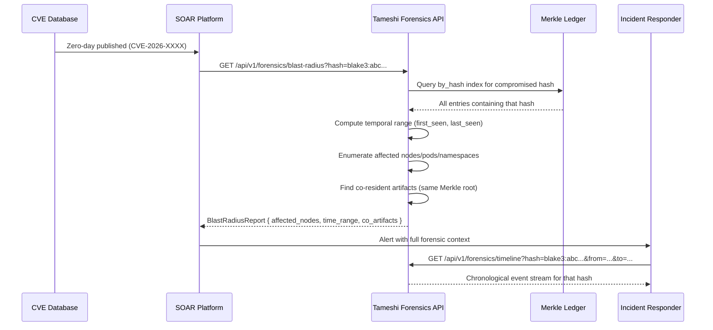

# Cryptographic Flight Data Recorder -- Forensics Roadmap

Architectural roadmap for immutable Merkle tree history, enabling forensic blast
radius analysis across the tameshi attestation platform.

---

## 1. The Problem

When a zero-day drops for a library we previously certified (e.g., libssl, log4j),
incident response teams need to answer three questions within the CIRCIA 72-hour
window:

- **Where** was the compromised artifact running? (nodes, pods, namespaces)
- **When** was it deployed and when was it last verified? (temporal range)
- **What** else was in the same certification artifact? (blast radius -- what other
  artifacts share the same Merkle root?)

Current HeartbeatChain records verification events but does not provide temporal
indexing of Merkle roots or blast radius queries.

---

## 2. Storage Mechanics (Append-Only Tamper-Proof Ledger)

**MerkleLedger**: A new append-only data structure that stores every
`CertificationArtifact` ever produced, along with its deployment context:

```rust
pub struct MerkleLedgerEntry {
    pub sequence: u64,
    pub timestamp: DateTime<Utc>,
    pub certification_artifact: CertificationArtifact,
    pub signed_root: SignedRoot,
    pub deployment_context: DeploymentContext,
    pub entry_hash: Blake3Hash,      // BLAKE3(all fields)
    pub previous_hash: Blake3Hash,   // chain linkage (same as HeartbeatChain)
}

pub struct DeploymentContext {
    pub cluster: String,
    pub namespace: String,
    pub node: String,
    pub pod: String,
    pub container: String,
    pub image_ref: String,
    pub binary_paths: Vec<String>,
    pub sdlc_chain_hash: Option<Blake3Hash>,
    pub compliance_report_hash: Option<Blake3Hash>,
}
```

**Tamper-proofing**:

- Same BLAKE3 hash chain as HeartbeatChain (each entry includes hash of previous)
- Persisted to S3 with Object Lock (WORM -- Write Once Read Many)
- Replicated to Akeyless Secure Audit Logs for independent verification
- ConsistencyProof enables remote verification without full ledger download

**Storage tiers**:

| Tier | Retention | Backend | Purpose |
|------|-----------|---------|---------|
| Hot  | Last 72 hours | In-memory | CIRCIA reporting window |
| Warm | Last 90 days | S3 Standard | Operational forensics |
| Cold | 2+ years | S3 Glacier | Regulatory retention |

---

## 3. Time-Series Provenance (Temporal Indexing)

**Indexes maintained**:

```
by_hash:      BTreeMap<Blake3Hash, Vec<LedgerEntryRef>>   // artifact/control/intent/composed_root
by_node:      BTreeMap<String, Vec<LedgerEntryRef>>        // cluster/node -> entries
by_namespace: BTreeMap<String, Vec<LedgerEntryRef>>        // namespace -> entries
by_time:      BTreeMap<DateTime<Utc>, Vec<LedgerEntryRef>> // temporal index
by_binary:    BTreeMap<String, Vec<LedgerEntryRef>>        // binary path -> entries
```

**Query: "Show me the artifact stack for Node-04 on March 22nd at 10:30 AM"**

```
GET /api/v1/forensics/provenance?node=node-04&at=2026-03-22T10:30:00Z
```

Returns: All CertificationArtifacts that were active on that node at that timestamp,
with their full Merkle trees, signed roots, and deployment contexts.

---

## 4. Blast Radius Query Design

**Input**: A compromised BLAKE3 hash (e.g., a poisoned binary hash from a CVE)

**Output**: The exact historical timeline -- every node, pod, namespace, and time
window where that hash was part of any CertificationArtifact

**Workflow**:



---

## 5. Implementation Phases

| Phase | Scope | Deliverable |
|-------|-------|-------------|
| 1 | MerkleLedger types + in-memory storage + query traits | `src/forensics.rs`, unit tests |
| 2 | S3 persistence with Object Lock | `S3LedgerEmitter`, WORM integration tests |
| 3 | Temporal indexing + blast radius query | Index builder, `BlastRadiusReport` type |
| 4 | API endpoints in kensa/sekiban | REST handlers, OpenAPI spec update |
| 5 | tameshi-watch integration (auto-query on new CVE) | CVE feed ingestion, auto-blast-radius |
| 6 | Akeyless Secure Audit Log replication | Dual-write, independent verification path |

---

## 6. CIRCIA Compliance

| Requirement | Mechanism |
|-------------|-----------|
| 72-hour reporting window | Hot tier (in-memory) covers the full window |
| Evidence preservation | S3 Object Lock ensures ledger cannot be modified |
| Chain integrity | ConsistencyProof enables third-party verification |
| Blast radius documentation | API produces machine-readable evidence for regulators |
