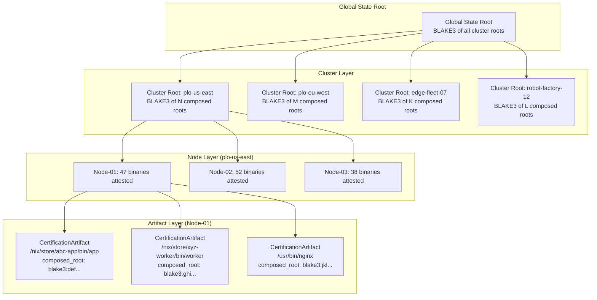
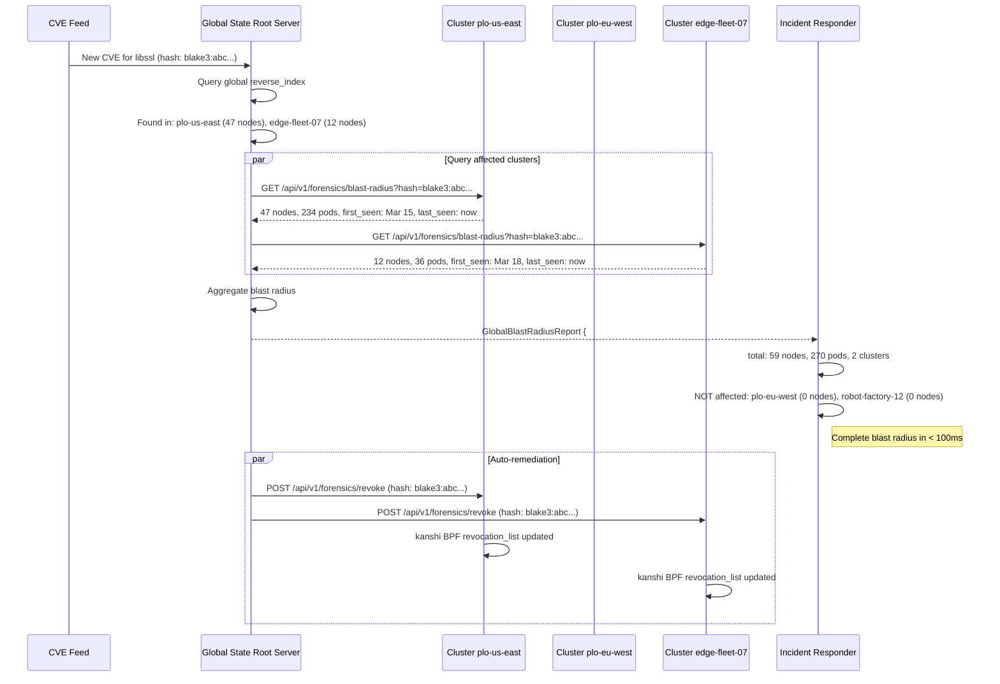
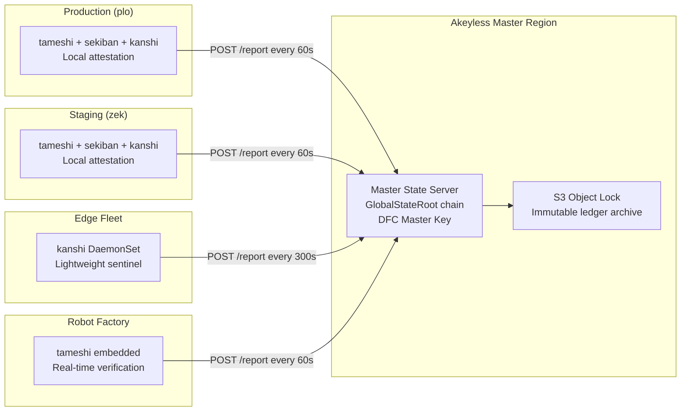

# Global State Root: Planetary-Scale Vulnerability Mapping

## 1. The Problem: Planetary-Scale Vulnerability Mapping

When a zero-day drops, the question is not "is this binary on one cluster?" -- it is
"where across our entire fleet of clusters, edge nodes, robot controllers, and IoT
devices does this compromised artifact exist?"

Current systems require querying every cluster individually. Each cluster runs its own
tameshi instance, its own sekiban webhook, its own kanshi eBPF sentinel. To answer the
blast radius question, an operator must:

1. Enumerate all clusters (K8s control planes, edge deployments, embedded fleets)
2. Query each cluster's tameshi API for the compromised hash
3. Aggregate results manually
4. Cross-reference against CVE context from tameshi-watch

At 100+ clusters with 10,000+ nodes, this takes hours. During those hours, the
compromised binary continues executing on every unpatched node.

We need milliseconds.

---

## 2. Federated Merkle Trees

Each local cluster (or robot fleet, or edge deployment) maintains its own tameshi
instance with:

- **Local HeartbeatChain** -- append-only verification log (`HeartbeatEntry` linked by
  `previous_hash`, verified via `ConsistencyProof`)
- **Local MerkleLedger** -- every `CertificationArtifact` ever produced, each binding
  `artifact_hash` (Nix/OCI provenance), `control_hash` (kensa compliance), and
  `intent_hash` (Pangea synthesis) into a 3-leaf Merkle tree with RFC 9162 domain
  separation
- **Local composed_root set** -- all active binary attestations (the `composed_root`
  values that populate kanshi's BPF allow map)

The federation layer adds:

- **ClusterRoot**: A single BLAKE3 hash representing the entire cluster's attestation
  state
- **Periodic reporting**: Each cluster publishes its ClusterRoot to the Master Server at
  configurable intervals (default: 60 seconds, matching `FederationConfig.replication_interval_secs`)
- **Signed roots**: Each ClusterRoot is signed by the cluster's DFC signer
  (`AkeylessDfcSigner` in production, `MockDfcSigner` for testing)

```
ClusterRoot = BLAKE3(
    sorted(
        composed_root_1 ||
        composed_root_2 ||
        ... ||
        composed_root_N
    )
)
```

This follows the same deterministic-ordering principle as `compute_merkle_root()` in
`src/merkle.rs` -- inputs are sorted before hashing to ensure order independence. The
`domain_separated_leaf()` function applies the `0x00` prefix to each composed root
before it enters the cluster-level tree, and `Blake3Algorithm::concat_and_hash()` applies
the `0x01` prefix for internal nodes. This maintains RFC 9162 domain separation at every
level of the hierarchy.



---

## 3. Master Tree Mechanics

The Master Server (centralized Akeyless-backed service) maintains:

```rust
pub struct GlobalStateRoot {
    /// BLAKE3 Merkle root of all cluster roots.
    pub root_hash: Blake3Hash,
    /// Per-cluster state, keyed by cluster_id for deterministic BTreeMap ordering.
    pub cluster_roots: BTreeMap<String, ClusterRootEntry>,
    /// When this global root was computed.
    pub computed_at: DateTime<Utc>,
    /// Monotonically increasing sequence number (same semantics as HeartbeatEntry.sequence).
    pub sequence: u64,
    /// BLAKE3 hash of the previous GlobalStateRoot (chain linkage).
    pub previous_root: Blake3Hash,
}

pub struct ClusterRootEntry {
    /// Unique cluster identifier (e.g., "plo-us-east", "edge-fleet-07").
    pub cluster_id: String,
    /// BLAKE3 Merkle root of all composed_roots on this cluster.
    pub cluster_root: Blake3Hash,
    /// DFC-signed root (using the cluster's AkeylessDfcSigner or MockDfcSigner).
    pub signed_root: SignedRoot,
    /// Number of nodes reporting attestations.
    pub node_count: u32,
    /// Total number of CertificationArtifacts across all nodes.
    pub artifact_count: u64,
    /// Last time this cluster reported its root.
    pub last_reported: DateTime<Utc>,
    /// Cluster liveness status.
    pub status: ClusterStatus,
}

pub enum ClusterStatus {
    /// Reported within last 2 intervals.
    Active,
    /// Missed 1-3 reporting intervals.
    Stale,
    /// Missed 3+ reporting intervals.
    Offline,
    /// Manually revoked by operator.
    Revoked,
}
```

### Recomputation

When any cluster reports a new root:

1. Update `cluster_roots[cluster_id]` with the new `ClusterRootEntry`
2. Recompute: `root_hash = BLAKE3(sorted cluster_root hashes)` -- using the same
   `Blake3Algorithm` with domain separation as `src/merkle.rs`
3. Sign with Master DFC key (`AkeylessDfcSigner` backed by the master Akeyless DFC
   classic key)
4. Append to GlobalStateRoot chain (append-only, same linkage pattern as `HeartbeatChain`)

### Consistency Guarantee

The GlobalStateRoot chain uses the same BLAKE3 linkage as `HeartbeatChain`:

```
GSR_0 ──hash──> GSR_1 ──hash──> GSR_2 ──hash──> GSR_n
  |               |               |               |
  +- prev: 0..0   +- prev: H(G0)  +- prev: H(G1)  +- prev: H(G_{n-1})
```

Tampering with any historical entry breaks the chain at the next entry.
`ConsistencyProof` (already implemented in `src/heartbeat.rs`) enables remote
verification between any two sequence numbers without downloading the full chain.

### Reverse Index

In addition to the forward Merkle tree, the Master Server maintains a reverse index:

```rust
/// Maps a composed_root hash to every cluster+node that contains it.
pub reverse_index: HashMap<Blake3Hash, Vec<ArtifactLocation>>,

pub struct ArtifactLocation {
    pub cluster_id: String,
    pub node_id: String,
    pub binary_path: String,
    pub first_seen: DateTime<Utc>,
    pub last_seen: DateTime<Utc>,
}
```

This reverse index is the key to sub-millisecond blast radius queries. When a CVE is
reported with a known hash, the lookup is O(1) in the reverse index rather than O(C * N)
across all clusters and nodes.

---

## 4. O(log N) Traversal for Incident Response

When a compromised hash is reported:

```
Step 1: Query GlobalStateRoot reverse index (O(1) hash lookup)
        -> Returns list of ArtifactLocations containing the hash

Step 2: For each affected cluster (O(log C) where C = clusters)
        -> Query cluster's MerkleLedger by_hash index
        -> Returns list of nodes/pods/timestamps

Step 3: For each affected node (O(log N) where N = nodes per cluster)
        -> Retrieve CertificationArtifact
        -> Extract deployment context (pod, container, binary path)

Total: O(log C * log N * log A) where A = artifacts per node
For 1000 clusters * 100 nodes * 1000 artifacts = O(10 * 7 * 10) ~ 700 comparisons
```

This is sub-millisecond on modern hardware.



### Blast Radius Report

```rust
pub struct GlobalBlastRadiusReport {
    /// The compromised hash being investigated.
    pub target_hash: Blake3Hash,
    /// CVE identifier (if triggered by tameshi-watch ingestion).
    pub cve_id: Option<String>,
    /// Clusters affected, with per-cluster detail.
    pub affected_clusters: Vec<ClusterBlastRadius>,
    /// Clusters confirmed NOT affected.
    pub unaffected_clusters: Vec<String>,
    /// Total nodes across all clusters containing the hash.
    pub total_affected_nodes: u32,
    /// Total pods/containers across all clusters.
    pub total_affected_pods: u64,
    /// When the first attestation of this hash was recorded (any cluster).
    pub first_seen_global: DateTime<Utc>,
    /// When the report was computed.
    pub computed_at: DateTime<Utc>,
    /// Wall-clock time to compute the report.
    pub computation_time_ms: u64,
}

pub struct ClusterBlastRadius {
    pub cluster_id: String,
    pub affected_nodes: u32,
    pub affected_pods: u64,
    pub first_seen: DateTime<Utc>,
    pub last_seen: DateTime<Utc>,
    /// Per-node breakdown of affected artifacts.
    pub node_details: Vec<NodeBlastRadius>,
}

pub struct NodeBlastRadius {
    pub node_id: String,
    pub binary_paths: Vec<String>,
    pub pod_names: Vec<String>,
    pub certification_artifact: CertificationArtifact,
}
```

---

## 5. API Endpoints (Global Level)

```
GET  /api/v1/global/state-root
     -> Current GlobalStateRoot with all cluster roots

GET  /api/v1/global/blast-radius?hash=blake3:abc...
     -> Aggregated blast radius across ALL clusters
     -> Returns: GlobalBlastRadiusReport

GET  /api/v1/global/clusters
     -> List of all clusters with status, node count, artifact count
     -> Filterable: ?status=active, ?status=stale, ?status=offline

GET  /api/v1/global/clusters/{id}/state
     -> Specific cluster's current state root and artifact summary

POST /api/v1/global/clusters/{id}/report
     -> Cluster reports its latest ClusterRoot (called by local tameshi)
     -> Body: ClusterRootEntry (signed by cluster's DFC key)
     -> Triggers: GlobalStateRoot recomputation

GET  /api/v1/global/history?from=...&to=...
     -> GlobalStateRoot chain history (append-only, tamper-evident)
     -> Supports ConsistencyProof verification between any two sequence numbers

POST /api/v1/global/revoke-everywhere
     -> Revoke a hash across ALL clusters simultaneously
     -> Fans out to each cluster's POST /api/v1/forensics/revoke endpoint
     -> Returns: per-cluster revocation confirmation

GET  /api/v1/global/reverse-index?hash=blake3:abc...
     -> Raw reverse index lookup: all clusters/nodes containing a hash
     -> Lower-level than blast-radius (no pod aggregation)
```

---

## 6. Integration with Existing Architecture

The GlobalStateRoot builds on existing primitives without modifying them:

| Existing Primitive | Location | How GlobalStateRoot Uses It |
|--------------------|----------|----------------------------|
| `Blake3Hash` | `tameshi/src/hash.rs` | All hashing at every level of the hierarchy |
| `domain_separated_leaf()` | `tameshi/src/merkle.rs` | Leaf domain separation (`0x00` prefix) for cluster-level and global-level trees |
| `Blake3Algorithm` | `tameshi/src/merkle.rs` | Internal node domain separation (`0x01` prefix) via `concat_and_hash()` |
| `SignedRoot` | `tameshi/src/signing.rs` | Cluster root signing (per-cluster DFC key) and global root signing (master DFC key) |
| `MerkleRootSigner` trait | `tameshi/src/signing.rs` | `AkeylessDfcSigner` for production, `MockDfcSigner` for testing |
| `HeartbeatChain` pattern | `tameshi/src/heartbeat.rs` | Append-only chain for GlobalStateRoot history (same `previous_hash` linkage) |
| `ConsistencyProof` | `tameshi/src/heartbeat.rs` | Remote verification of GlobalStateRoot chain segments |
| `CertificationArtifact` | `tameshi/src/certification_artifact.rs` | The leaf-level data: each artifact's `composed_root` feeds into the cluster tree |
| `FederationConfig` | `sekiban/src/federation/config.rs` | Cluster-to-master communication configuration (`RemoteCluster`, `KubeconfigSource`) |
| `CertificationReplicator` | `sekiban/src/federation/replicator.rs` | Snapshot creation and cross-cluster replication transport |
| `FederationVerifier` | `sekiban/src/federation/verifier.rs` | Trusted cluster verification (`TrustedCluster`, `RemoteVerifyResult`) |
| tameshi-watch | (CVE ingestion service) | Triggers global blast radius queries when new CVEs are ingested |

### Data Flow

```
Local tameshi instance (per cluster)
    |
    +-- compose_certification_artifact() produces CertificationArtifact
    |       with composed_root (3-leaf Merkle: artifact + control + intent)
    |
    +-- All composed_roots sorted, hashed into ClusterRoot
    |       using Blake3Algorithm with RFC 9162 domain separation
    |
    +-- ClusterRoot signed by cluster's AkeylessDfcSigner
    |
    +-- CertificationReplicator pushes ClusterRootEntry
            to Master Server via POST /api/v1/global/clusters/{id}/report
                |
                v
Master Server
    |
    +-- Updates cluster_roots BTreeMap
    +-- Recomputes GlobalStateRoot (BLAKE3 of sorted cluster roots)
    +-- Signs with master AkeylessDfcSigner
    +-- Appends to GlobalStateRoot chain (HeartbeatChain pattern)
    +-- Updates reverse_index for O(1) hash lookups
```

---

## 7. Scaling Properties

| Metric | Value | Basis |
|--------|-------|-------|
| Clusters | 10,000+ | BTreeMap lookup O(log N) |
| Nodes per cluster | 1,000+ | BTreeMap lookup O(log N) |
| Artifacts per node | 10,000+ | HashMap reverse index O(1) |
| Global blast radius query | < 100ms | O(1) reverse index + O(log C * log N) detail fetch + network RTT |
| State root recomputation | < 10ms | BLAKE3 of sorted hashes (BLAKE3 processes ~1 GB/s on modern CPUs) |
| Reverse index update | < 1ms | HashMap insert per artifact delta |
| Storage per year (1000 clusters, 60s intervals) | ~26 GB | ~50 KB per GlobalStateRoot entry * 525,600 entries/year |
| Network per cluster (60s intervals) | ~50 KB/min | ClusterRootEntry + delta artifact list |

### Why BLAKE3

BLAKE3's performance characteristics make it uniquely suited for this workload:

- **4x faster than SHA-256** on single-threaded workloads
- **Scales linearly with cores** via built-in SIMD parallelism
- **Incremental hashing** -- `blake3::Hasher` supports streaming updates, enabling
  delta recomputation when a single cluster root changes
- **256-bit output** -- sufficient collision resistance for the combined keyspace of
  all clusters and artifacts globally

### Cluster Root Delta Protocol

To minimize network overhead, clusters report only deltas:

```rust
pub struct ClusterRootReport {
    pub cluster_id: String,
    pub cluster_root: Blake3Hash,
    pub signed_root: SignedRoot,
    pub node_count: u32,
    pub artifact_count: u64,
    /// Only artifacts added since last report.
    pub added_artifacts: Vec<ArtifactDelta>,
    /// Only artifacts removed since last report.
    pub removed_artifacts: Vec<Blake3Hash>,
    /// Sequence number of the last report this cluster received acknowledgment for.
    pub last_ack_sequence: u64,
}

pub struct ArtifactDelta {
    pub composed_root: Blake3Hash,
    pub node_id: String,
    pub binary_path: String,
}
```

---

## 8. Deployment Topology



### Master Server High Availability

The Master Server runs as a stateless service backed by:

- **S3 Object Lock** -- immutable append-only storage for the GlobalStateRoot chain.
  Each entry is written as a versioned object with legal hold, preventing deletion
  or modification. This satisfies CIRCIA 72-hour evidence preservation requirements.
- **Akeyless DFC** -- the master signing key never exists in one piece. Threshold
  signing is performed by the Akeyless gateway enclave. Key compromise requires
  compromising the Akeyless infrastructure itself.
- **Multi-region replication** -- S3 cross-region replication ensures the ledger
  survives region-level failures. The Master Server can be restarted in any region
  by replaying the S3 ledger.

### Edge and IoT Considerations

Edge nodes and IoT devices may have constrained connectivity:

| Deployment Type | Report Interval | Payload Size | Connectivity |
|-----------------|-----------------|--------------|--------------|
| K8s cluster (plo/zek) | 60s | Full ClusterRootReport | Always-on |
| Edge fleet | 300s | ClusterRootReport with deltas | Intermittent |
| Robot controller | 60s | ClusterRootReport | Factory LAN |
| IoT sensor fleet | 3600s | Minimal (root + count only) | Cellular/LoRa |

For intermittent connectivity, the local tameshi instance continues operating
independently. The HeartbeatChain accumulates locally. When connectivity is restored,
the cluster reports its latest root and the Master Server catches up via delta
reconciliation. The `last_ack_sequence` field in `ClusterRootReport` enables
reliable delivery without duplicating artifacts.

---

## 9. Threat Model

### Attacks Mitigated

| Attack | Mitigation |
|--------|------------|
| **Cluster root forgery** | Every ClusterRoot is DFC-signed. The Master Server verifies signatures via `FederationVerifier` before accepting reports. Unknown or untrusted clusters receive `RemoteVerifyResult::UnknownCluster`. |
| **Global root tampering** | GlobalStateRoot chain uses append-only BLAKE3 linkage. S3 Object Lock prevents deletion. ConsistencyProof enables any auditor to verify chain integrity. |
| **Reverse index poisoning** | Reverse index is derived exclusively from verified ClusterRootEntries. An attacker would need to compromise a cluster's DFC key to inject false artifacts. |
| **Replay attack** | Each ClusterRootReport includes `last_ack_sequence`. The Master Server rejects reports with sequence numbers older than the last acknowledged report. |
| **Split-brain** | BTreeMap ordering of cluster roots ensures deterministic GlobalStateRoot computation. Two Master Server instances processing the same cluster reports produce identical roots. |
| **Stale cluster masking** | `ClusterStatus` transitions from Active to Stale to Offline based on missed intervals. Offline clusters are flagged in blast radius reports as "status unknown -- last report N hours ago." |

### Trust Boundaries

```
Untrusted:  Internet, edge networks, factory LANs
            |
            v
Authenticated (mTLS + DFC signature):
            Cluster -> Master Server communication
            |
            v
Trusted:    Master Server + Akeyless DFC enclave
            S3 Object Lock ledger (immutable)
```

---

## 10. Implementation Phases

### Phase 1: ClusterRoot Computation (tameshi)

Add `ClusterRoot` computation to tameshi core:

```rust
// New in tameshi/src/global.rs
pub fn compute_cluster_root(artifacts: &[CertificationArtifact]) -> Blake3Hash {
    if artifacts.is_empty() {
        return Blake3Hash::digest(b"empty-cluster");
    }
    let mut roots: Vec<[u8; 32]> = artifacts
        .iter()
        .map(|a| a.composed_root.0)
        .collect();
    roots.sort();
    let leaves: Vec<[u8; 32]> = roots
        .iter()
        .map(|r| domain_separated_leaf(r))
        .collect();
    let tree = MerkleTree::<Blake3Algorithm>::from_leaves(&leaves);
    Blake3Hash(tree.root().unwrap_or([0u8; 32]))
}
```

### Phase 2: Cluster Reporting (sekiban federation)

Extend `CertificationReplicator` to push `ClusterRootReport` to the Master Server
instead of individual `CertificationSnapshot`s. The existing `FederationConfig`
already has `replication_interval_secs` and `remote_clusters` -- the Master Server
becomes a special remote cluster entry.

### Phase 3: Master Server

New binary (`tameshi-master`) that:

- Accepts `ClusterRootReport` via authenticated REST API
- Maintains `GlobalStateRoot` chain in memory + S3
- Serves blast radius queries
- Integrates with tameshi-watch for CVE-triggered queries

### Phase 4: Auto-Remediation

When tameshi-watch ingests a CVE matching a known hash:

1. Query `GlobalBlastRadiusReport`
2. For each affected cluster, POST revocation to kanshi's BPF `tameshi_revocation_list`
3. Log `HeartbeatEvent::Revocation` on each cluster's HeartbeatChain
4. Log global revocation event on the GlobalStateRoot chain
5. Generate CIRCIA-compliant incident report with full blast radius evidence
