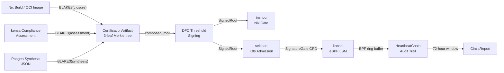

# tameshi

Kernel-enforced cryptographic supply chain integrity for Kubernetes.

## The Problem: The Last Mile of Trust

You can sign images. You can scan for CVEs. You can gate admission webhooks. None of that stops a modified binary from executing on a Linux node after deployment.

Every existing tool verifies artifacts before they reach the kernel. Once a binary is on disk and the kubelet calls `execve()`, the attestation chain ends. The kernel does not care about your Cosign signatures or your SLSA provenance. It runs whatever bytes are at the file path.

This is the last mile of trust. Attestation gets you to the door. Nothing walks through it with you.

Standard pipelines -- even SLSA Level 3 -- verify "this artifact was built by this pipeline." They do not verify "this is the artifact currently executing on this node." Between the CI signature and the `execve()` syscall, there is a gap. Container registries can be compromised. Binaries can be modified on disk. Shared libraries can be injected via `dlopen()`. Nothing in the current toolchain prevents execution of unattested code at the kernel level.

## The Solution

tameshi closes the last mile with eBPF LSM hooks that verify BLAKE3 content hashes at `execve()` time. Every binary must have a mathematically proven `CertificationArtifact` binding three sources of truth into a single 256-bit cryptographic commitment:

- **Provenance** -- Nix derivation hash or OCI manifest digest
- **Compliance** -- kensa assessment result (NIST 800-53 / OSCAL)
- **Intent** -- Pangea synthesis output (infrastructure-as-code declaration)

These three inputs compose into a 3-leaf Merkle tree with RFC 9162 domain separation, signed by Akeyless Distributed Fragment Cryptography (threshold signing where the key never exists in one piece). The composed root populates the BPF allow map. If the hash is not in the map, the kernel returns `EPERM`.



## Key Numbers

| Metric | Value |
|--------|-------|
| Passing tests across ecosystem | 3,288 (0 failures) |
| Repositories | 9 |
| Compliance profiles available | ~14,800 |
| NIST 800-53 Rev. 5 controls mapped | 14 |
| Red team vulnerabilities found and fixed | 5 |
| SDLC phases attested | 8 |
| LSM hooks enforced | 5 (execve, open, mmap, mprotect, inode) |
| BPF map types | 4 (allow, revocation, policy, events) |
| Layer types | 14 |

## Architecture

| Repository | Purpose | Tests |
|------------|---------|------:|
| [tameshi](https://github.com/pleme-io/tameshi) | Core attestation library -- BLAKE3 Merkle trees, CertificationArtifact, 14 layer types, 30+ traits, HeartbeatChain, SDLC chain | 1,178 |
| [sekiban](https://github.com/pleme-io/sekiban) | K8s ValidatingAdmissionWebhook -- fail-closed, OCI digest enforcement, SignatureGate/Certification/CompliancePolicy CRDs, Helm chart | 417 |
| [kensa](https://github.com/pleme-io/kensa) | Compliance engine -- CompliancePlugin trait, 4 domain plugins (kernel/nix/oci/k8s), NIST 800-53 mapping, OSCAL output, two-phase certification | 546 |
| [kanshi](https://github.com/pleme-io/kanshi) | eBPF runtime sentinel -- LSM `bprm_check_security` hook, BPF allow/revocation maps, EventMetricsCollector, CirciaReport | 135 |
| [inshou](https://github.com/pleme-io/inshou) | Nix pre-rebuild gate -- `App<N,C,P,K,F>` fully testable generic architecture, 7 traits, fail-secure | 457 |
| [tameshi-watch](https://github.com/pleme-io/tameshi-watch) | CVE ingestion daemon -- 7 sources (NVD, OSV, GitHub Advisory, Rust Advisory, vulnix, MITRE SAF, dev-sec.io), dedup, severity filter | 144 |
| [compliance-forge](https://github.com/pleme-io/compliance-forge) | Compliance control generator -- auto-generates controls from Pangea resource definitions and TOML specs | 137 |
| [inspec-rspec](https://github.com/pleme-io/inspec-rspec) | Deterministic InSpec-to-RSpec transpiler -- hash-stable output, NIST/CIS tag preservation | 94 |
| [iac-test-runner](https://github.com/pleme-io/iac-test-runner) | K8s IaC test orchestrator -- Init/Apply/Verify/Teardown pipeline, 5 platform adapters, Helm chart | 180 |

## Regulatory Alignment

| Framework | Coverage |
|-----------|----------|
| **NIST SP 800-53 Rev. 5** | 14 controls: SR-4 (provenance), SI-7 (software integrity), CM-2/CM-3/CM-6/CM-8 (configuration), AC-3/AC-6 (access enforcement), AU-2/AU-3/AU-6/AU-9/AU-10 (audit), SC-12 (key management) |
| **CIRCIA** | HeartbeatChain provides continuous tamper-evident evidence; CirciaReport covers 72-hour reporting window; BreakGlassToken events cryptographically logged |
| **FedRAMP / OSCAL** | kensa produces OSCAL 1.1.2 assessment results; machine-readable compliance evidence chains to CertificationArtifact |
| **SLSA** | Level 1: Nix flake build graph (provenance exists). Level 2: CI + SignedRoot (signed provenance). Level 3: Nix hermetic builds + DFC threshold signing (hardened, non-falsifiable). Level 4: organizational control (two-person review) |

## Quick Start

### Run Tests

```bash
git clone https://github.com/pleme-io/tameshi.git && cd tameshi
cargo test    # 1,178 tests
```

### Deploy sekiban (K8s Admission Gate)

```bash
helm install sekiban oci://ghcr.io/pleme-io/charts/sekiban \
  --namespace sekiban-system --create-namespace \
  --set webhook.failurePolicy=Fail
```

### Deploy kanshi (eBPF Runtime Enforcement)

```bash
# Requires CONFIG_BPF_LSM=y in kernel config
helm install kanshi oci://ghcr.io/pleme-io/charts/kanshi \
  --namespace kanshi-system --create-namespace \
  --set enforcementPolicy=Enforce
```

### Create a SignatureGate

```bash
kubectl apply -f - <<EOF
apiVersion: tameshi.pleme.io/v1
kind: SignatureGate
metadata:
  name: production-gate
  namespace: production
spec:
  expectedSignature: "blake3:<composed_root_hex>"
  targetResources:
    - group: apps
      kind: Deployment
      operations: [CREATE, UPDATE]
EOF
```

## How It Works

1. **Build** -- Nix produces a deterministic closure. `NixCollector` computes `BLAKE3(closure)`.
2. **Attest** -- `compose_certification_artifact()` binds artifact hash (leaf 0), compliance hash (leaf 1), and intent hash (leaf 2) into a 3-leaf Merkle tree with RFC 9162 domain separation (`0x00` leaf prefix, `0x01` internal node prefix).
3. **Sign** -- `AkeylessDfcSigner` signs the `composed_root` via threshold cryptography. The signing key never exists in one piece -- fragments are distributed across Akeyless infrastructure.
4. **Gate (Nix)** -- inshou verifies the `SignedRoot` before allowing `nixos-rebuild switch`. Fail-secure: no fallback paths.
5. **Gate (K8s)** -- sekiban's `ValidatingAdmissionWebhook` intercepts every K8s API mutation, verifies the `sekiban.pleme.io/signature` annotation against the `SignatureGate` CRD. Fail-closed with 3-second timeout. `validate_image_digests()` rejects mutable tags, requiring `@sha256:` digest references.
6. **Enforce (kernel)** -- kanshi's eBPF LSM `bprm_check_security` hook verifies the BLAKE3 hash at `execve()`. Revocation list checked before allow map. `enforce_or_fail()`: Enforce mode without BPF LSM is a hard error -- no silent degradation.
7. **Audit** -- Every verification event appends to the `HeartbeatChain` -- a BLAKE3-linked, append-only, tamper-evident chain with `ConsistencyProof` (CT-style incremental verification). Persisted to S3 via `S3Emitter`.

## Certificate of Architectural Integrity

Every security claim in this repository is machine-verifiable across
three independent mathematical layers:

| Layer | Tool | Scope | Status |
|-------|------|-------|--------|
| 1 | Proptest | 39 properties x 10,000 cases (390,000 hostile inputs) | **PASS** |
| 2 | Kani (AWS) | 30 bounded model checking harnesses (exhaustive) | **PASS** |
| 3 | F* (MSR) | 10 formal proof modules (unbounded) | **PASS** |

**Theorem coverage**: All 15 theorems and 7 corollaries from
`docs/mathematical-foundations.md` are mapped to at least one
passing proptest, verified Kani harness, or type-checked F* lemma.

**Structural coverage**: The `#[repr(C)]` FFI boundary between
Rust (`src/bpf_loader.rs`) and C (`bpf/kanshi_enforcer.bpf.c`)
is verified byte-identical by Kani for ALL possible field values.

**Refinement coverage**: The full-stack chain Ferrite (is_safe) →
Tameshi (compose) → Kernel (is_authorized) is proved in F*
without `admit()`.

To independently verify:

```bash
git clone https://github.com/pleme-io/tameshi && cd tameshi
nix run .#verify-all        # All 3 layers
cargo test                  # 1,446+ unit/e2e/doc tests
```

See `docs/grand-unified-specification.md` for the complete
architectural specification.

## License

MIT
